Part1: Image processing
=======================

.. code:: ipython3

    # Import Libraries
    import numpy as np
    import matplotlib.pyplot as plt
    from tifffile import imread, imsave
    import skimage.measure 
    import pickle as pkl
    import os
    
    # Import FoamQuant library
    from FoamQuant import *
    
    # Set matplotlib default font size
    plt.rc('font', size=20) 

.. code:: ipython3

    # Create the processing pipeline
    ProcessPipeline = ['P1_Raw','P2_PhaseSegmented','P3_Cleaned','P4_BubbleSegmented','P5_BubbleNoEdge']
    
    for Pi in ProcessPipeline:
        if  os.path.exists(Pi):
            print('path already exist:',Pi)
        else:
            print('Created:',Pi)
            os.mkdir(Pi)

.. parsed-literal::

    path already exist: P1_Raw
    path already exist: P2_PhaseSegmented
    path already exist: P3_Cleaned
    path already exist: P4_BubbleSegmented
    path already exist: P5_BubbleNoEdge

The raw image
=============

.. code:: ipython3

    # Read/Save image names and directories
    nameread = 'Raw_'
    namesave = 'PhaseSegmented_'
    dirread = ProcessPipeline[0]+'/'
    dirsave = ProcessPipeline[1]+'/'
    # Images indexes
    imrange = [1,2,3,4,5,6,7,8,9,10]

.. code:: ipython3

    # Read the first image of the series
    Raw = imread(dirread+nameread+strindex(imrange[0], 3)+'.tiff')

.. code:: ipython3

    # Show a 3D-cut view of the volume
    Cut3D(Raw, 
          showcuts=True, 
          showaxes=True, 
          figblocksize=7,
          zcut=15,       # tune this parrameter if you wish
          ycut=False,    # tune this parrameter if you wish
          xcut=False)    # tune this parrameter if you wish

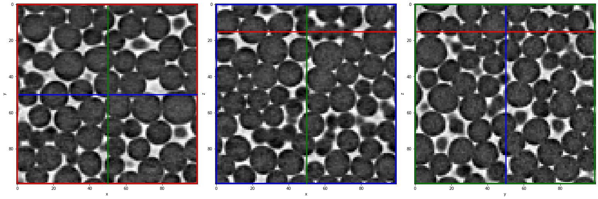

Phase segmentation
==================

.. code:: ipython3

    # Otsu simple threshold phase segmentation of the whole series
    th = PhaseSegmentation_Batch(nameread, 
                                 namesave, 
                                 dirread, 
                                 dirsave, 
                                 imrange, 
                                 method='ostu_global',
                                 returnOtsu=True, 
                                 verbose=True, 
                                 n0=3, 
                                 endread='.tiff', 
                                 endsave='.tif')

.. parsed-literal::

    PhaseSegmented_ 1: done
    
    PhaseSegmented_ 2: done
    
    PhaseSegmented_ 3: done
    
    PhaseSegmented_ 4: done
    
    PhaseSegmented_ 5: done
    
    PhaseSegmented_ 6: done
    
    PhaseSegmented_ 7: done
    
    PhaseSegmented_ 8: done
    
    PhaseSegmented_ 9: done
    
    PhaseSegmented_ 10: done
    

.. code:: ipython3

    # Otsu thresholds
    print('Otsu thresholds:',th)

.. parsed-literal::

    Otsu thresholds: [125.009766, 125.009766, 125.009766, 126.00586, 126.00586, 126.00586, 126.00586, 126.00586, 126.00586, 126.00586]

.. code:: ipython3

    ## Let's see the result...
    # Read the first image of the series
    Seg = imread(dirsave+namesave+strindex(imrange[0], 3)+'.tif')

.. code:: ipython3

    zcut=15       # tune this parrameter if you wish
    ycut=False    # tune this parrameter if you wish
    xcut=False    # tune this parrameter if you wish
    
    # Show a 3D-cut view of the volume
    Cut3D(Seg, showcuts=True, showaxes=True, figblocksize=5,zcut=zcut,ycut=ycut,xcut=xcut)         # Phase segmented image
    Cut3D(Seg*Raw, showcuts=True, showaxes=True, figblocksize=5,zcut=zcut,ycut=ycut,xcut=xcut)     # Phase segmented image * Raw image
    Cut3D((1-Seg)*Raw, showcuts=True, showaxes=True, figblocksize=5,zcut=zcut,ycut=ycut,xcut=xcut) # (1-Phase segmented image) * Raw image

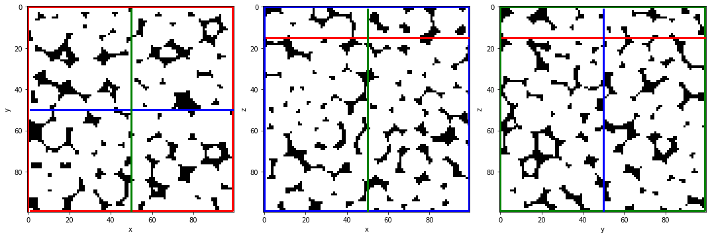

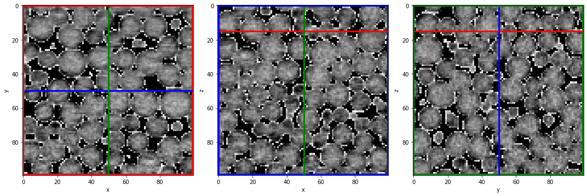

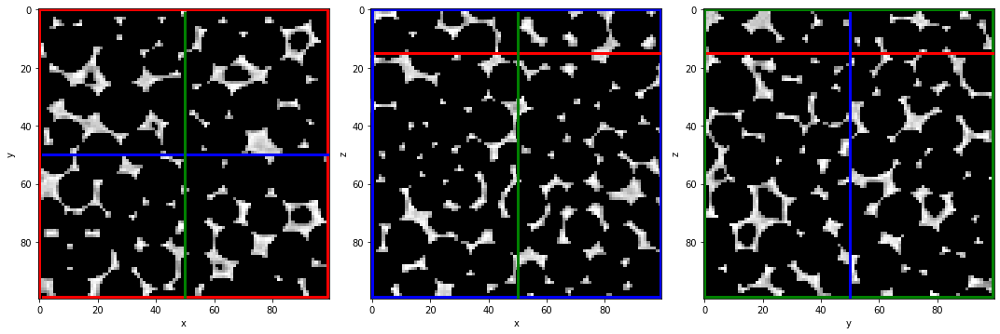

Remove small holes & regions
============================

.. code:: ipython3

    # Read/Save image names and directories
    nameread = 'PhaseSegmented_'
    namesave = 'Cleaned_'
    dirread = ProcessPipeline[1]+'/'
    dirsave = ProcessPipeline[2]+'/'
    # Images indexes
    imrange = [1,2,3,4,5,6,7,8,9,10]

.. code:: ipython3

    # Remove all holes and objects with:
    # Vobj < Cobj * max(Vobj)
    # Vhole < Chole * max(Vhole)
    
    # Since in liquid foam images, the liquid and gas phases both consist of unique large regions, 
    # Cobj and Chole can be strict (large thresholds). All the other smaller regions are often due to imaging artefacts.
    RemoveSpeckleBin_Batch(nameread, 
                           namesave, 
                           dirread, 
                           dirsave, 
                           imrange, 
                           verbose=True, 
                           endread='.tif', 
                           endsave='.tif', 
                           n0=3, 
                           Cobj=0.1,  # tune this parrameter if you wish
                           Chole=0.1) # tune this parrameter if you wish

.. parsed-literal::

    Before: Nobj 3
    After: Nobj 1
    Before: Nobj 5
    After: Nobj 1
    First image (vox): maxObj 848018 maxHole 151965
    Thresholds (vox): thrObj 84802 thrHole 15196 
    
    Before: Nhol 3
    After: Nhol 1
    Before: Nhol 5
    After: Nhol 1
    Cleaned_001: done
    
    Before: Nhol 2
    After: Nhol 1
    Before: Nhol 5
    After: Nhol 1
    Cleaned_002: done
    
    Before: Nhol 1

.. parsed-literal::

    /gpfs/offline1/staff/tomograms/users/flosch/Rheometer_Jupyter/FoamQuant/Process.py:199: UserWarning: Only one label was provided to `remove_small_objects`. Did you mean to use a boolean array?
      image = remove_small_objects(label(image), min_size=Vminobj)

.. parsed-literal::

    After: Nhol 1
    Before: Nhol 5
    After: Nhol 1
    Cleaned_003: done
    
    Before: Nhol 3
    After: Nhol 1
    Before: Nhol 3
    After: Nhol 1
    Cleaned_004: done
    
    Before: Nhol 3
    After: Nhol 1
    Before: Nhol 2
    After: Nhol 1
    Cleaned_005: done
    
    Before: Nhol 4
    After: Nhol 1
    Before: Nhol 3
    After: Nhol 1
    Cleaned_006: done
    
    Before: Nhol 2
    After: Nhol 1
    Before: Nhol 4
    After: Nhol 1
    Cleaned_007: done
    
    Before: Nhol 2
    After: Nhol 1
    Before: Nhol 3
    After: Nhol 1
    Cleaned_008: done
    
    Before: Nhol 2
    After: Nhol 1
    Before: Nhol 6
    After: Nhol 1
    Cleaned_009: done
    
    Before: Nhol 1
    After: Nhol 1
    Before: Nhol 8
    After: Nhol 1
    Cleaned_010: done
    

.. code:: ipython3

    ## Let's see the result...
    # Read the first image of the series
    Cleaned = imread(dirsave+namesave+strindex(imrange[1], 3)+'.tif')
    # Show a 3D-cut view of the volume
    Cut3D(Cleaned, showcuts=True, showaxes=True)

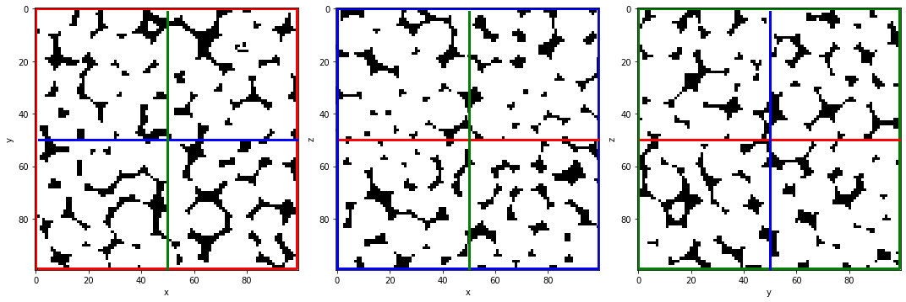

.. code:: ipython3

    ## ... we cannot see much like this
    ## Let's check again the number of objects and holes in the images
    for imi in imrange:
        # Read the "non-cleaned" image
        NoCleaned = imread(dirread+nameread+strindex(imi, 3)+'.tif') 
        # regprops of obj and holes
        regions_obj=skimage.measure.regionprops(skimage.measure.label(NoCleaned))
        regions_holes=skimage.measure.regionprops(skimage.measure.label(NoCleaned<1))
        # number of obj and holes
        print(nameread+strindex(imi, 3),'Number of objects:',len(regions_obj), 'Number of holes:',len(regions_holes))

.. parsed-literal::

    PhaseSegmented_001 Number of objects: 3 Number of holes: 5
    PhaseSegmented_002 Number of objects: 2 Number of holes: 5
    PhaseSegmented_003 Number of objects: 1 Number of holes: 5
    PhaseSegmented_004 Number of objects: 3 Number of holes: 3
    PhaseSegmented_005 Number of objects: 3 Number of holes: 2
    PhaseSegmented_006 Number of objects: 4 Number of holes: 3
    PhaseSegmented_007 Number of objects: 2 Number of holes: 4
    PhaseSegmented_008 Number of objects: 2 Number of holes: 3
    PhaseSegmented_009 Number of objects: 2 Number of holes: 6
    PhaseSegmented_010 Number of objects: 1 Number of holes: 8

.. code:: ipython3

    for imi in imrange:
        # Read the "cleaned" image
        Cleaned = imread(dirsave+namesave+strindex(imi, 3)+'.tif')
        # regprops of obj and holes
        regions_obj=skimage.measure.regionprops(skimage.measure.label(Cleaned))
        regions_holes=skimage.measure.regionprops(skimage.measure.label(Cleaned<1))
        # number of obj and holes
        print(namesave+strindex(imi, 3),'Number of objects:',len(regions_obj), 'Number of holes:',len(regions_holes))

.. parsed-literal::

    Cleaned_001 Number of objects: 1 Number of holes: 1
    Cleaned_002 Number of objects: 1 Number of holes: 1
    Cleaned_003 Number of objects: 1 Number of holes: 1
    Cleaned_004 Number of objects: 1 Number of holes: 1
    Cleaned_005 Number of objects: 1 Number of holes: 1
    Cleaned_006 Number of objects: 1 Number of holes: 1
    Cleaned_007 Number of objects: 1 Number of holes: 1
    Cleaned_008 Number of objects: 1 Number of holes: 1
    Cleaned_009 Number of objects: 1 Number of holes: 1
    Cleaned_010 Number of objects: 1 Number of holes: 1

Labelled images
===============

.. code:: ipython3

    # Read/Save image names and directories
    nameread = 'Cleaned_'
    namesave = 'BubbleSeg_'
    dirread = ProcessPipeline[2]+'/'
    dirsave = ProcessPipeline[3]+'/'
    # Images indexes
    imrange = [1,2,3,4,5,6,7,8,9,10]

.. code:: ipython3

    # Segment the bubbles with default parrameters 
    # for more parrameters, try help(BubbleSegmentation_Batch)
    BubbleSegmentation_Batch(nameread, 
                             namesave, 
                             dirread, 
                             dirsave, 
                             imrange, 
                             verbose=True, 
                             endread='.tif', 
                             endsave='.tif', 
                             n0=3)

.. parsed-literal::

    Path exist: True
    Distance map: done
    Seeds distance map: done
    Seeds: done
    Watershed distance map: done
    Watershed: done
    BubbleSeg_001: done
    
    Distance map: done
    Seeds distance map: done
    Seeds: done
    Watershed distance map: done
    Watershed: done
    BubbleSeg_002: done
    
    Distance map: done
    Seeds distance map: done
    Seeds: done
    Watershed distance map: done
    Watershed: done
    BubbleSeg_003: done
    
    Distance map: done
    Seeds distance map: done
    Seeds: done
    Watershed distance map: done
    Watershed: done
    BubbleSeg_004: done
    
    Distance map: done
    Seeds distance map: done
    Seeds: done
    Watershed distance map: done
    Watershed: done
    BubbleSeg_005: done
    
    Distance map: done
    Seeds distance map: done
    Seeds: done
    Watershed distance map: done
    Watershed: done
    BubbleSeg_006: done
    
    Distance map: done
    Seeds distance map: done
    Seeds: done
    Watershed distance map: done
    Watershed: done
    BubbleSeg_007: done
    
    Distance map: done
    Seeds distance map: done
    Seeds: done
    Watershed distance map: done
    Watershed: done
    BubbleSeg_008: done
    
    Distance map: done
    Seeds distance map: done
    Seeds: done
    Watershed distance map: done
    Watershed: done
    BubbleSeg_009: done
    
    Distance map: done
    Seeds distance map: done
    Seeds: done
    Watershed distance map: done
    Watershed: done
    BubbleSeg_010: done
    

.. code:: ipython3

    # Create a random colormap
    rcmap = RandomCmap(1000)

.. parsed-literal::

    Number of labels: 1000

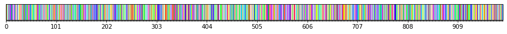

.. code:: ipython3

    ## Let's see the result...
    # Read the first image of the series
    Lab = imread(dirsave+namesave+strindex(imrange[0], 3)+'.tif')
    # Show a 3D-cut view of the volume
    Cut3D(Lab, 
          showcuts=True, 
          showaxes=True, 
          cmap=rcmap, 
          interpolation='nearest', 
          figblocksize=7,           # tune this parrameter if you wish
          zcut=11,                  # tune this parrameter if you wish
          ycut=False,               # tune this parrameter if you wish
          xcut=False)               # tune this parrameter if you wish

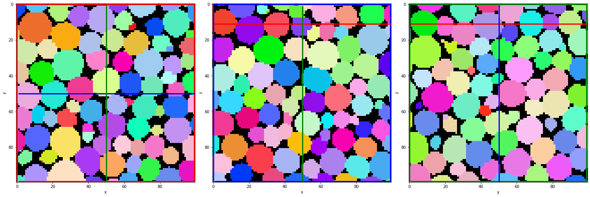

Part2: Quantification image by image
====================================

.. code:: ipython3

    # Create the quantification folders
    QuantFolders = ['Q1_LiquidFraction','Q2_RegProps','Q3_Tracking','Q4_MergedTracking']
    
    for Qi in QuantFolders:
        if os.path.exists(Qi):
            print('path already exist:',Qi)
        else:
            print('Created:',Qi)
            os.mkdir(Qi)

.. parsed-literal::

    path already exist: Q1_LiquidFraction
    path already exist: Q2_RegProps
    path already exist: Q3_Tracking
    path already exist: Q4_MergedTracking

A] Liquid fraction
==================

.. code:: ipython3

    # Read/Save names and directories
    nameread = 'Cleaned_'
    namesave = 'LFGlob_'
    dirread = ProcessPipeline[2]+'/'
    dirsave = QuantFolders[0]+'/'
    # Images indexes
    imrange = [1,2,3,4,5,6,7,8,9,10]

1) Whole images liquid fraction
-------------------------------

.. code:: ipython3

    # Get the whole images liquid fraction 
    # (volume percentage of liquid)
    LiqFrac_Batch(nameread, 
                  namesave, 
                  dirread, 
                  dirsave, 
                  imrange, 
                  TypeGrid='Global', 
                  verbose=10, 
                  structured=False)

.. parsed-literal::

    Path exist: True
    Liquid fraction image 1: done
    crop:None
    LiqFrac:0.151967
    LFGlob_001: done
    Liquid fraction image 2: done
    crop:None
    LiqFrac:0.151677
    LFGlob_002: done
    Liquid fraction image 3: done
    crop:None
    LiqFrac:0.151722
    LFGlob_003: done
    Liquid fraction image 4: done
    crop:None
    LiqFrac:0.150571
    LFGlob_004: done
    Liquid fraction image 5: done
    crop:None
    LiqFrac:0.150594
    LFGlob_005: done
    Liquid fraction image 6: done
    crop:None
    LiqFrac:0.150727
    LFGlob_006: done
    Liquid fraction image 7: done
    crop:None
    LiqFrac:0.150864
    LFGlob_007: done
    Liquid fraction image 8: done
    crop:None
    LiqFrac:0.150145
    LFGlob_008: done
    Liquid fraction image 9: done
    crop:None
    LiqFrac:0.150034
    LFGlob_009: done
    Liquid fraction image 10: done
    crop:None
    LiqFrac:0.149189
    LFGlob_010: done

.. code:: ipython3

    ## Let's see the result...
    # Read the liquid fraction of the first image of the series
    with open(dirsave + namesave + '001' + '.pkl','rb') as f:
        LF = pkl.load(f)['lf']

.. code:: ipython3

    print('Whole image liquid fraction:',LF,'%')

.. parsed-literal::

    Whole image liquid fraction: 0.151967 %

2) Cartesian subvolumes of liquid fraction
------------------------------------------

.. code:: ipython3

    # Read/Save image names and directories
    nameread = 'Cleaned_'
    namesave = 'LFCartesMesh_'
    dirread = ProcessPipeline[2]+'/'
    dirsave = QuantFolders[0]+'/'
    # Images indexes
    imrange = [1,2,3,4,5,6,7,8,9,10]

.. code:: ipython3

    # Get liquid fraction in cartesian subvolumes
    # (volume percentage of liquid in each subvolumes)
    LiqFrac_Batch(nameread, 
                  namesave, 
                  dirread, 
                  dirsave, 
                  imrange, 
                  TypeGrid='CartesMesh', 
                  Nz=5,        # tune this parrameter if you wish
                  Ny=5,        # tune this parrameter if you wish
                  Nx=5,        # tune this parrameter if you wish
                  verbose=1,
                  structured=True)

.. parsed-literal::

    Path exist: True
    LFCartesMesh_001: done
    LFCartesMesh_002: done
    LFCartesMesh_003: done
    LFCartesMesh_004: done
    LFCartesMesh_005: done
    LFCartesMesh_006: done
    LFCartesMesh_007: done
    LFCartesMesh_008: done
    LFCartesMesh_009: done
    LFCartesMesh_010: done

.. code:: ipython3

    # Read the cartesian grid of liquid fraction
    LF=[]
    for imi in imrange:
        imifordir = strindex(imi, n0=3)
        with open(dirsave + namesave + imifordir + '.pkl','rb') as f:
            LF.append(pkl.load(f)['lf'])
    LF=np.mean(LF,0)

.. code:: ipython3

    # If "structured=True", the liquid fraction is saved as a 3D mesh by LiqFrac_Batch
    # Such as for 3D images, we can reuse Cut3D or Proj3D to vizualise the liquid-fraction meshed volume
    fig,ax,neg = Cut3D(LF, 
                       vmin=0.0,    # tune this parrameter if you wish
                       vmax=0.36,   # tune this parrameter if you wish
                       cmap='jet', 
                       printminmax=True, 
                       returnfig=True, 
                       colorbars=True)

.. parsed-literal::

    vmin = 0.0 vmax = 0.36
    MIN: 0.1129 MAX: 0.18101249999999997
    Min0: 0.11782499999999999 Min0: 0.176425
    Min1: 0.11782499999999999 Max1 0.1705625
    Min2: 0.133775 Max2: 0.18031250000000001

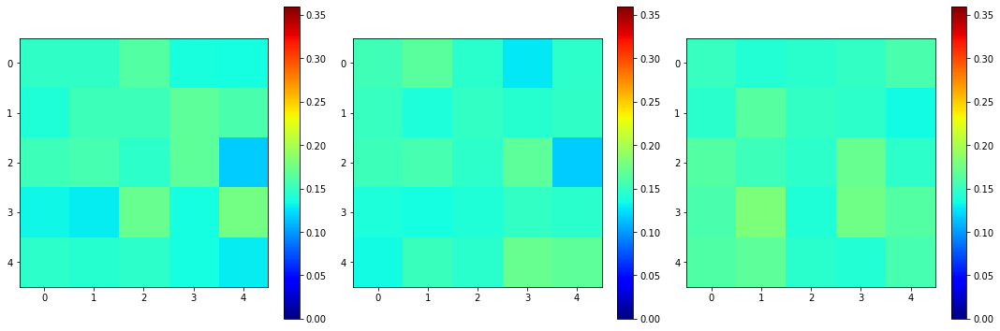

.. code:: ipython3

    # The Proj3D function is similar to Cut3D, but show an average along the 3 directions
    fig,ax,neg = Proj3D(LF, 
                        vmin=0.0,    # tune this parrameter if you wish
                        vmax=0.36,   # tune this parrameter if you wish
                        cmap='jet', 
                        printminmax=True, 
                        returnfig=True, 
                        colorbars=True)

.. parsed-literal::

    vmin = 0.0 vmax = 0.36
    MIN: 0.1129 MAX: 0.18101249999999997
    Min0: 0.13665 Min0: 0.16530999999999998
    Min1: 0.1397875 Max1 0.1630375
    Min2: 0.13962000000000002 Max2: 0.1647325

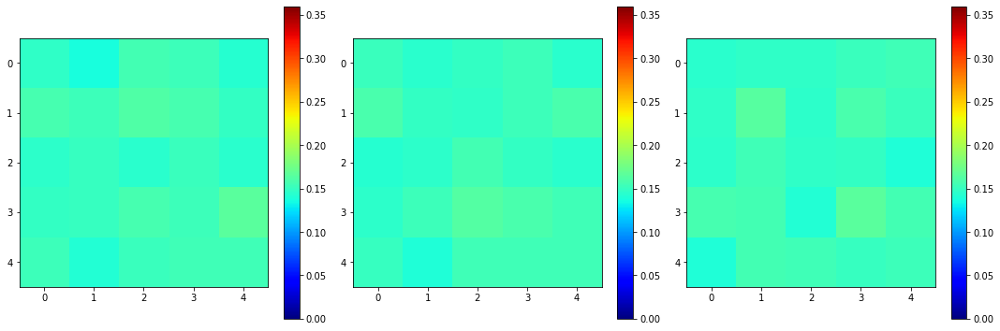

.. code:: ipython3

    # If "structured=False", the liquid fraction is saved as a 1D array by LiqFrac_Batch
    # This may be practical if one want to plot the liquid fraction as a function of other parrameters 
    # such as the cartesian/cylindrical/spherical coordinates or the bubble deformation, for example.
    LiqFrac_Batch(nameread, 
                  namesave, 
                  dirread, 
                  dirsave, 
                  imrange, 
                  TypeGrid='CartesMesh', 
                  Nz=10,      # tune this parrameter if you wish
                  Ny=5,       # tune this parrameter if you wish
                  Nx=5,       # tune this parrameter if you wish
                  verbose=1,
                  structured=False)

.. parsed-literal::

    Path exist: True
    LFCartesMesh_001: done
    LFCartesMesh_002: done
    LFCartesMesh_003: done
    LFCartesMesh_004: done
    LFCartesMesh_005: done
    LFCartesMesh_006: done
    LFCartesMesh_007: done
    LFCartesMesh_008: done
    LFCartesMesh_009: done
    LFCartesMesh_010: done

.. code:: ipython3

    # We can plot the liquid fraction as a function of the z coordinate for the first image
    with open(dirsave + namesave + '001' + '.pkl','rb') as f:
        pack = pkl.load(f)
    lf = pack['lf']
    z = pack['zgrid']
    
    fig, ax = plt.subplots(1,1, figsize = (10, 10))
    plt.plot(z, lf,'ko')
    plt.xlabel(r'$z$ (vox)')
    plt.ylabel(r'$\phi_l$')
    plt.ylim((0,0.36))
    plt.grid(True)  

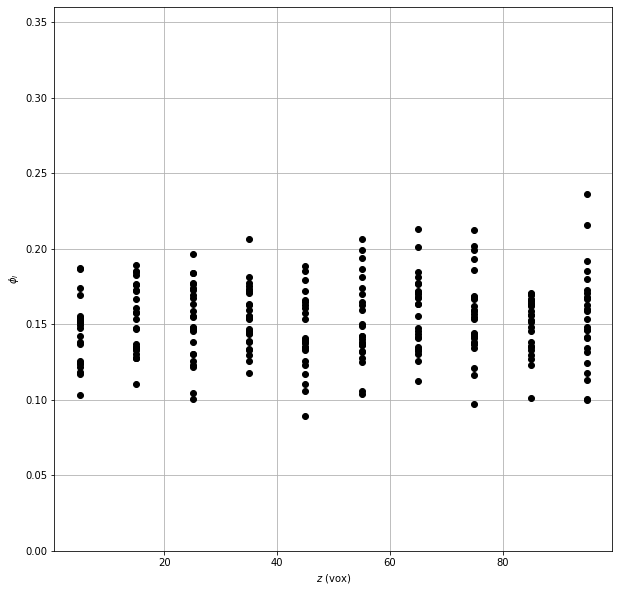

B] Individual volume, equivalent radius, sphericity, moment of inertial, strain tensor
======================================================================================

.. code:: ipython3

    # Read/Save names and directories
    nameread = 'BubbleSeg_'
    namesave = 'Props_'
    dirread = ProcessPipeline[3]+'/'
    dirsave = QuantFolders[1]+'/'
    # Images indexes
    imrange = [1,2,3,4,5,6,7,8,9,10]

.. code:: ipython3

    # Get some properties in the given field of view 
    # (field=[zmin,zmax,ymin,ymax,xmin,xmax])
    
    # Label and centroid coodinate: 'lab','z','y','x'
    # Volume, equivalent radius, area, sphericity: 'vol','rad','area','sph'
    # Volume from ellipsoid fit: 'volfit'
    # Ellipsoid three semi-axis and eigenvectors: 'S1','S2','S3','e1z','e1y','e1x','e2z','e2y','e2x','e3z','e3y','e3x',
    # Internal strain components: 'U1','U2','U3'
    # Internal strain von Mises invariant: 'U'
    # Oblate (-1) or prolate (1) ellipsoid:'type'
    
    RegionProp_Batch(nameread,
                     namesave,
                     dirread,
                     dirsave,
                     imrange,
                     verbose=True,
                     field=[10,80,10,80,10,80], # tune this parrameter if you wish
                     endread='.tif', 
                     endsave='.tsv')

.. parsed-literal::

    Path exist: True
    Props_001: done
    Props_002: done
    Props_003: done
    Props_004: done
    Props_005: done
    Props_006: done
    Props_007: done
    Props_008: done
    Props_009: done
    Props_010: done

.. code:: ipython3

    # Read the regionprop files
    properties = Read_RegionProp(namesave, dirsave, imrange)

.. code:: ipython3

    # histogram of some extracted properties
    prop=['vol','rad','area','sph']
    xlab=[r'$Volume$ (vox)',r'$Radius$ (vox)',r'$Area$ (vox)',r'$Sphericity$']
    
    fig, ax = plt.subplots(1,4, figsize = (5*4, 5), constrained_layout=True)
    for i in range(4):
        H=ax[i].hist(properties[prop[i]], bins=50)
        ax[i].set_xlabel(xlab[i])
        ax[i].set_ylabel(r'Frequency')
        ax[i].grid(True)
        ax[i].set_yscale('log')   # tune this parrameter if you wish

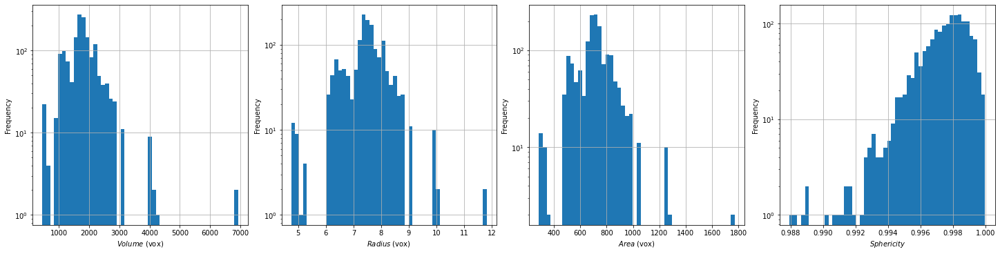

.. code:: ipython3

    # histogram of some other extracted properties
    fig, ax = plt.subplots(1,2, figsize = (5*2, 5), constrained_layout=True)
    H=ax[0].hist(properties['vol']/properties['volfit'], bins=50)
    ax[0].set_xlabel(r'V/Vfit')
    H=ax[1].hist(properties['U']*properties['type'], bins=50)
    ax[1].set_xlabel(r'U*type')    
    for i in range(2):
        ax[i].set_ylabel(r'Frequency')
        ax[i].grid(True)
        ax[i].set_yscale('log')   # tune this parrameter if you wish

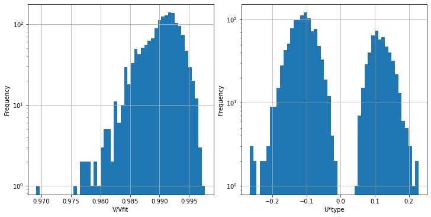

More properties can be extracted from individual images, such as coordination (number of neighbours and contact topology), and individual contact area and orientation. The SPAM package is great for extracting these properties! Have a look here if you wish to know more:
~~~~~~~~~~~~~~~~~~~~~~~~~~~~~~~~~~~~~~~~~~~~~~~~~~~~~~~~~~~~~~~~~~~~~~~~~~~~~~~~~~~~~~~~~~~~~~~~~~~~~~~~~~~~~~~~~~~~~~~~~~~~~~~~~~~~~~~~~~~~~~~~~~~~~~~~~~~~~~~~~~~~~~~~~~~~~~~~~~~~~~~~~~~~~~~~~~~~~~~~~~~~~~~~~~~~~~~~~~~~~~~~~~~~~~~~~~~~~~~~~~~~~~~~~~~~~~~~~~~~~~~~~~~~~

https://ttk.gricad-pages.univ-grenoble-alpes.fr/spam/
~~~~~~~~~~~~~~~~~~~~~~~~~~~~~~~~~~~~~~~~~~~~~~~~~~~~~

C] Tracking individual bubble between subsequent images
=======================================================

.. code:: ipython3

    # Read/Save image names and directories
    nameread = 'Props_'
    namesave = 'Tracking_'
    dirread = QuantFolders[1]+'/'
    dirsave = QuantFolders[2]+'/'
    # Images indexes
    imrange = [1,2,3,4,5,6,7,8,9,10]

.. code:: ipython3

    # Track the bubbles from one image to the next:
    # - keep the bubbles candidate if their centroid is inside the box searchbox=[zmin,zmax,ymin,ymax,xmin,xmax]
    # - keep the bubbles candidate if the volume from one image to the next is not changing more than Volpercent 
    #   (the next volume should be between (1-Volpercent)*V and (1+Volpercent)*V)
    # - select the bubble with the closest distance
    
    LLostlab, LLostX, LLostY, LLostZ = LabelTracking_Batch(nameread, 
                                                           namesave, 
                                                           dirread, 
                                                           dirsave,
                                                           imrange,
                                                           verbose=False,
                                                           endread='.tsv',
                                                           endsave='.tsv',
                                                           n0=3,
                                                           searchbox=[-5,5,-5,5,-5,5],   # tune this parrameter if you wish
                                                           Volpercent=0.05)              # tune this parrameter if you wish
    
    # Lost tracking: N percentage
    # Lost tracking: 2 1.2738853503184715 %

.. parsed-literal::

    Path exist: True
    Lost tracking: 2 1.2738853503184715 %
    Lost tracking: 6 3.79746835443038 %
    Lost tracking: 4 2.564102564102564 %
    Lost tracking: 3 1.9607843137254901 %
    Lost tracking: 6 3.7267080745341614 %
    Lost tracking: 5 3.1645569620253164 %
    Lost tracking: 7 4.430379746835443 %
    Lost tracking: 5 3.205128205128205 %
    Lost tracking: 6 3.870967741935484 %

.. code:: ipython3

    # Read the tracking files
    tracking = Read_LabelTracking(namesave, dirsave, imrange, verbose=True)

.. parsed-literal::

    Tracking_001_002 : done
    Tracking_002_003 : done
    Tracking_003_004 : done
    Tracking_004_005 : done
    Tracking_005_006 : done
    Tracking_006_007 : done
    Tracking_007_008 : done
    Tracking_008_009 : done
    Tracking_009_010 : done

.. code:: ipython3

    # Convert -1 in np.nan 
    # and create Coord and v arrays (non-structured coordinate and velocity arrays)
    Listx1 = tracking['x1']
    Listy1 = tracking['y1']
    Listz1 = tracking['z1']
    
    Listx2 = tracking['x2']
    Listy2 = tracking['y2']
    Listz2 = tracking['z2']
    
    Coord = []; v=[]
    for vali in range(len(Listx1)):
        for i in range(len(Listx1[vali])):
            if Listx1[vali][i]==-1:
                Listx1[vali][i]=np.nan
            if Listy1[vali][i]==-1:
                Listy1[vali][i]=np.nan
            if Listz1[vali][i]==-1:
                Listz1[vali][i]=np.nan
            if Listx2[vali][i]==-1:
                Listx2[vali][i]=np.nan
            if Listy2[vali][i]==-1:
                Listy2[vali][i]=np.nan
            if Listz2[vali][i]==-1:
                Listz2[vali][i]=np.nan
            Coord.append([Listz1[vali][i],
                          Listy1[vali][i],
                          Listx1[vali][i]])
            v.append([Listz2[vali][i]-Listz1[vali][i], 
                      Listy2[vali][i]-Listy1[vali][i], 
                      Listx2[vali][i]-Listx1[vali][i]])
            
    Coord=np.asarray(Coord)
    v=np.asarray(v)

.. code:: ipython3

    # Create a linear colormap
    lincmap = LinCmap(vmin=0, vmax=len(LLostX), first_color="lime", last_color="k")

.. code:: ipython3

    fig, ax = plt.subplots(1,3, figsize = (45, 15), constrained_layout=True)
    # Plot of tracked bubbles (green)
    for i in range(len(Listx1)):
        ax[0].plot([Listx1[i],Listx2[i]],[Listy1[i],Listy2[i]],'.-', color=lincmap.to_rgba(i))
        ax[1].plot([Listx1[i],Listx2[i]],[Listz1[i],Listz2[i]],'.-', color=lincmap.to_rgba(i))
        ax[2].plot([Listy1[i],Listy2[i]],[Listz1[i],Listz2[i]],'.-', color=lincmap.to_rgba(i))
    # Plot of the lost position (red)
    for i in range(len(LLostlab)):
        ax[0].plot(LLostX[i],LLostY[i],'ro')
        ax[1].plot(LLostX[i],LLostZ[i],'ro')
        ax[2].plot(LLostY[i],LLostZ[i],'ro')
    # Axes
    ax[0].set_xlabel('x'); ax[0].set_ylabel('y')
    ax[1].set_xlabel('x'); ax[1].set_ylabel('z')
    ax[2].set_xlabel('y'); ax[2].set_ylabel('z')

.. parsed-literal::

    Text(0, 0.5, 'z')

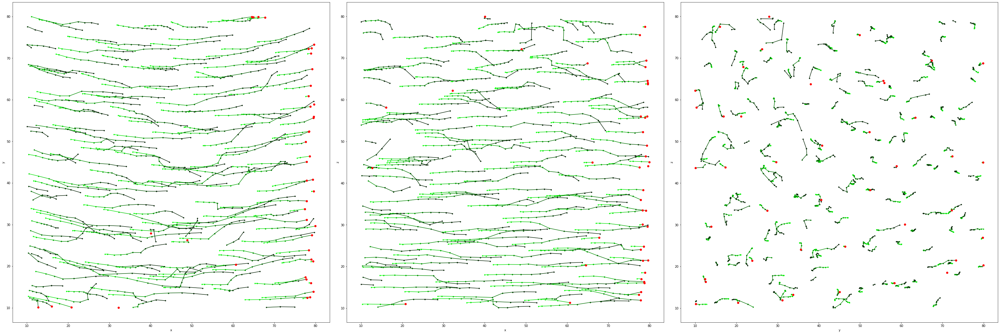

.. code:: ipython3

    # in 3D!
    # Plot of tracked bubbles (green)
    ax = plt.figure(figsize = (10, 10)).add_subplot(projection='3d')
    for i in range(len(Listx1)):
        for j in range(len(Listx1[i])):
            ax.plot([Listx1[i][j],Listx2[i][j]],
                    [Listy1[i][j],Listy2[i][j]],
                    [Listz1[i][j],Listz2[i][j]],
                    '.-', color=lincmap.to_rgba(i))
    # Plot of the lost position (red)
    for i in range(len(LLostlab)):
        ax.plot(LLostX[i],LLostY[i],LLostZ[i],'ro')
    # Axes
    ax.set(xlim=(10, 80), ylim=(10, 80), zlim=(10, 80),
           xlabel='x', ylabel='y', zlabel='z')

.. parsed-literal::

    [(10.0, 80.0),
     (10.0, 80.0),
     (10.0, 80.0),
     Text(0.5, 0, 'x'),
     Text(0.5, 0.5, 'y'),
     Text(0.5, 0, 'z')]

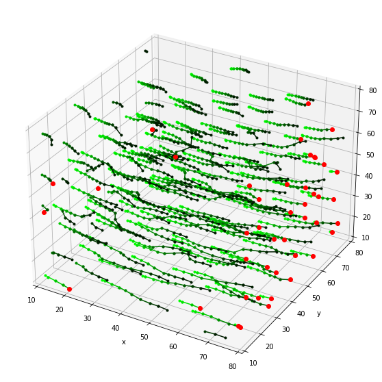

.. code:: ipython3

    # If structured=True, Grid_Vavg function can be used to obtained cartesian 3D structured average flow field (here respectively along z,y,x)
    # tune Range and N parrameters if you wish
    Lgrid_z, Coordavg_z,Vavg_z,Vstd_z, Count_z = Grid_Vavg(Coord, v, Range=[0,90,0,90,0,90], N=[1,10,10], NanFill=True, verbose=False, structured=True)
    Lgrid_y, Coordavg_y,Vavg_y,Vstd_y, Count_y = Grid_Vavg(Coord, v, Range=[0,90,0,90,0,90], N=[10,1,10], NanFill=True, verbose=False, structured=True)
    Lgrid_x, Coordavg_x,Vavg_x,Vstd_x, Count_x = Grid_Vavg(Coord, v, Range=[0,90,0,90,0,90], N=[10,10,1], NanFill=True, verbose=False, structured=True)

.. code:: ipython3

    vmin=0   # tune this parrameter if you wish
    vmax=40  # tune this parrameter if you wish
    
    fig, ax = plt.subplots(1,3, figsize = (30, 10), constrained_layout=True)
    # Colormesh plot of the number of bubble inside the averaging box
    neg1=ax[0].pcolormesh(Lgrid_z[2],Lgrid_z[1], Count_z[0,:,:], cmap = 'jet', shading='nearest', vmin=vmin,vmax=vmax)
    neg2=ax[1].pcolormesh(Lgrid_y[2],Lgrid_y[0], Count_y[:,0,:], cmap = 'jet', shading='nearest', vmin=vmin,vmax=vmax)
    neg3=ax[2].pcolormesh(Lgrid_x[1],Lgrid_x[0], Count_x[:,:,0], cmap = 'jet', shading='nearest', vmin=vmin,vmax=vmax)
    # Averaged flow field
    ax[0].quiver(Lgrid_z[2],Lgrid_z[1],Vavg_z[0,:,:,2],Vavg_z[0,:,:,1], pivot='mid')
    ax[1].quiver(Lgrid_y[2],Lgrid_y[0],Vavg_y[:,0,:,2],Vavg_y[:,0,:,0], pivot='mid')
    ax[2].quiver(Lgrid_x[1],Lgrid_x[0],Vavg_x[:,:,0,1],Vavg_x[:,:,0,0], pivot='mid')
    # Axes
    ax[0].set_xlabel('x'); ax[0].set_ylabel('y')
    ax[1].set_xlabel('x'); ax[1].set_ylabel('z')
    ax[2].set_xlabel('y'); ax[2].set_ylabel('z')
    # Colorbars
    fig.colorbar(neg1, label='Count')
    fig.colorbar(neg2, label='Count')
    fig.colorbar(neg3, label='Count')

.. parsed-literal::

    <matplotlib.colorbar.Colorbar at 0x2b2cfce7f8b0>

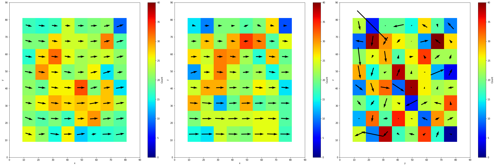

.. code:: ipython3

    # If structured=False, Grid_Vavg function can be used to obtained the same average, but unstructured. 
    # Here it is convenient for plotting the velocity along x as a function of the position z
    Lgrid, Coordavg,Pavg,Pstd, Count = Grid_Pavg(Coord, 
                                                 v[:,2], 
                                                 Range=[0,90,0,90,0,90],  # tune this parrameter if you wish
                                                 N=[10,1,1],              # tune this parrameter if you wish
                                                 NanFill=True, 
                                                 verbose=False, 
                                                 structured=False)

.. code:: ipython3

    # Velocity along x as a function of the position z 
    ax = plt.figure(figsize = (10, 10))
    for vali in range(len(Listx1)):
        plt.plot(Listz1[vali], Listx2[vali]-Listx1[vali],'.')
    # Averaged velocity along x as a function of the position z 
    plt.errorbar(Coordavg[:,0], Pavg, yerr=Pstd, capsize=5, color='k')

.. parsed-literal::

    <ErrorbarContainer object of 3 artists>

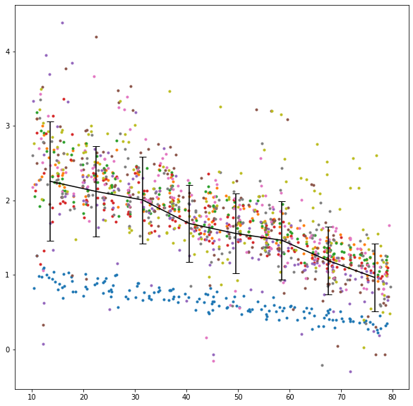

D] Tracking individual bubble over the whole time series
========================================================

.. code:: ipython3

    # Combine the subsequent trackings over the whole series
    combined = Combine_Tracking(namesave, dirsave, imrange, verbose=False, endread='.tsv', n0=3)

.. code:: ipython3

    # Convert lost bubbles data into np.nan
    for axis in ['z','y','x']:
        for i in range(len(combined[axis])):
            for j in range(len(combined[axis][i])):
                if combined[axis][i][j]==-1:
                    combined[axis][i][j]=np.nan

.. code:: ipython3

    # Show the individual paths by a random color
    fig, ax = plt.subplots(1,3, figsize = (45, 15), constrained_layout=True)
    for i in range(len(combined['x'])):
        ax[0].plot(combined['x'][i],combined['y'][i])
        ax[1].plot(combined['x'][i],combined['z'][i])
        ax[2].plot(combined['y'][i],combined['z'][i])
    # Axes
    ax[0].set_xlabel('x'); ax[0].set_ylabel('y')
    ax[1].set_xlabel('x'); ax[1].set_ylabel('z')
    ax[2].set_xlabel('y'); ax[2].set_ylabel('z')

.. parsed-literal::

    Text(0, 0.5, 'z')

.. image:: A_Processing_Example_files/A_Processing_Example_61_1.png

.. code:: ipython3

    # in 3D!
    # Show the individual paths by a random color
    ax = plt.figure(figsize = (10, 10)).add_subplot(projection='3d')
    for i in range(len(combined['x'])):
        plt.plot(combined['x'][i],combined['y'][i],combined['z'][i], '.-')
    # Axes
    ax.set(xlim=(10, 80), ylim=(10, 80), zlim=(10, 80),
           xlabel='x', ylabel='y', zlabel='z')

.. parsed-literal::

    [(10.0, 80.0),
     (10.0, 80.0),
     (10.0, 80.0),
     Text(0.5, 0, 'x'),
     Text(0.5, 0.5, 'y'),
     Text(0.5, 0, 'z')]

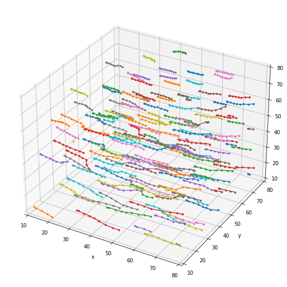

.. code:: ipython3

    # in 3D!
    # Show the non-tracked paths in red
    ax = plt.figure(figsize = (10, 10)).add_subplot(projection='3d')
    for i in range(len(Listx1)):
        for j in range(len(Listx1[i])):
            ax.plot([Listx1[i][j],Listx2[i][j]],
                    [Listy1[i][j],Listy2[i][j]],
                    [Listz1[i][j],Listz2[i][j]],
                    'r,-')
    # Show the tracked paths in green
    for i in range(len(combined['x'])):
        ax.plot(combined['x'][i],combined['y'][i],combined['z'][i], 'g.-')

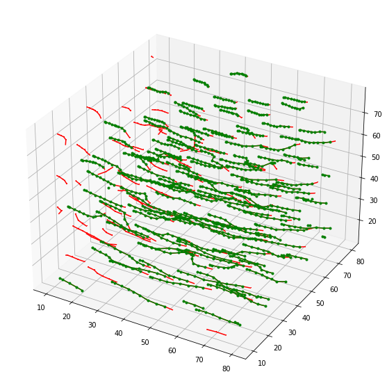

.. code:: ipython3

    # Create a linear colormap
    lincmap = LinCmap(vmin=0, vmax=len(LLostX), first_color="b", last_color="r")

.. code:: ipython3

    # Individual tracked bubble x velocity as a function of its z position
    ax = plt.figure(figsize = (20, 10))
    for i in range(len(combined['x'])):
        for j in range(1,len(combined['x'][i])-2):
            plt.plot([combined['z'][i][j],combined['z'][i][j+1]],
                     [combined['x'][i][j+1]-combined['x'][i][j],
                      combined['x'][i][j+2]-combined['x'][i][j+1]],
                     '.-', color=lincmap.to_rgba(j))
    # Axes
    plt.xlabel('z (vox)'); plt.ylabel('Vx (vox/image)')

.. parsed-literal::

    Text(0, 0.5, 'Vx (vox/image)')

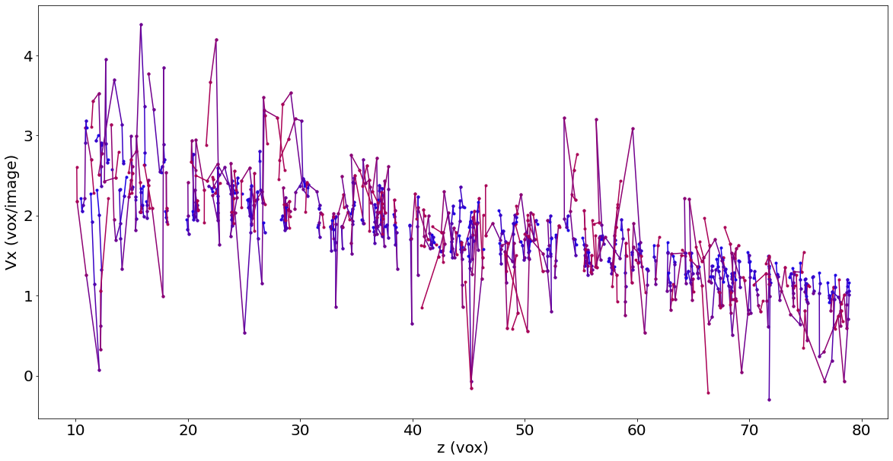

.. code:: ipython3

    # Individual bubble velocity as a function of 
    fig, ax = plt.subplots(1,3, figsize = (30, 10), constrained_layout=True)
    for i in range(len(combined['x'])):
        for j in range(len(combined['x'][i])-2):
            ax[0].plot([j,j+1],
                     [combined['x'][i][j+1]-combined['x'][i][j],
                      combined['x'][i][j+2]-combined['x'][i][j+1]],
                     '.-', color=lincmap.to_rgba(j))
            ax[1].plot([j,j+1],
                     [combined['y'][i][j+1]-combined['y'][i][j],
                      combined['y'][i][j+2]-combined['y'][i][j+1]],
                     '.-', color=lincmap.to_rgba(j))
            ax[2].plot([j,j+1],
                     [combined['z'][i][j+1]-combined['z'][i][j],
                      combined['z'][i][j+2]-combined['z'][i][j+1]],
                     '.-', color=lincmap.to_rgba(j))
    # Axes
    ax[0].set_xlabel('time index'); ax[0].set_ylabel('Vx (vox/image)')
    ax[1].set_xlabel('time index'); ax[1].set_ylabel('Vy (vox/image)')
    ax[2].set_xlabel('time index'); ax[2].set_ylabel('Vz (vox/image)')

.. parsed-literal::

    Text(0, 0.5, 'Vz (vox/image)')

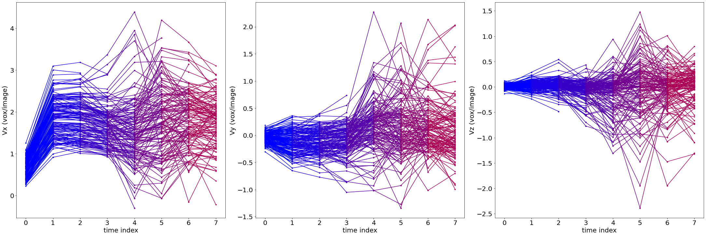

