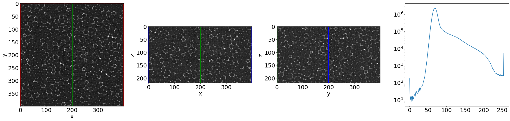
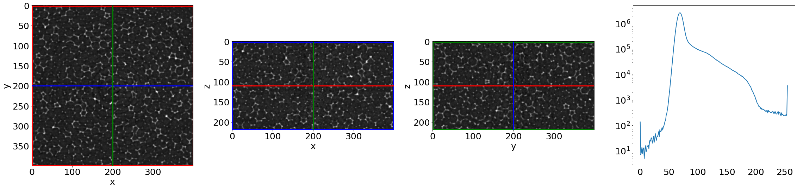
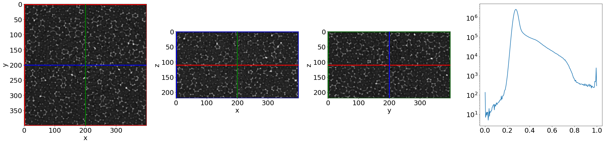
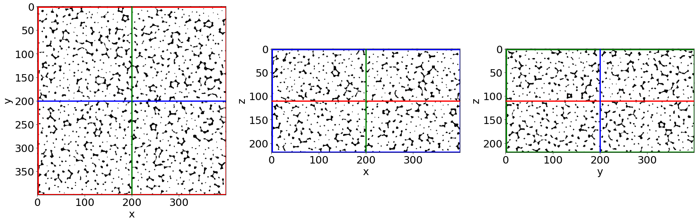
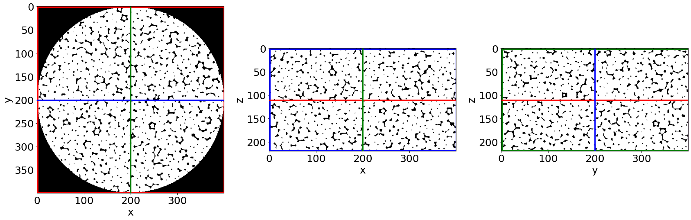
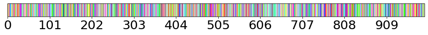
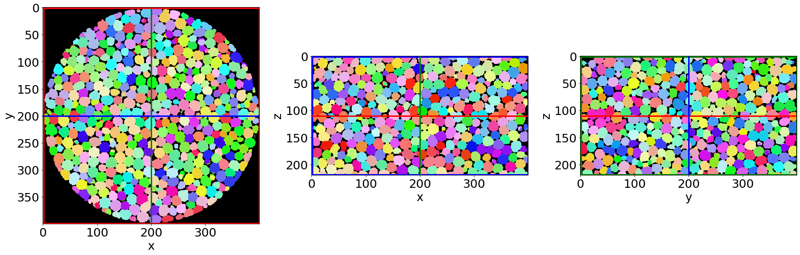
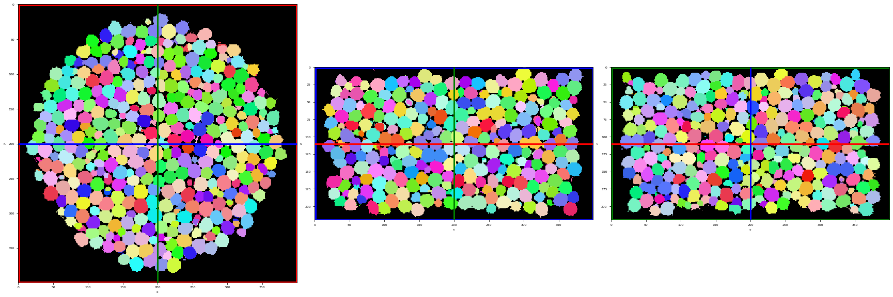

Liquid foam image processing
~~~~~~~~~~~~~~~~~~~~~~~~~~~~

1) Remove speckle
2) Remove background
3) Phase segmentation
4) Masking
5) Remove small regions and holes (salt and pepper)
6) Bubble segmentation
7) Remove bubbles at the edges

.. code:: ipython3

    # Import standard libraries
    import numpy as np
    import matplotlib.pyplot as plt
    from tifffile import imsave, imread
    #import csv
    
    # Import FoamQuant modules
    from Package.Basic.RangeList import RangeList
    from Package.Basic.ReadRaw import ReadRaw
    from Package.Figure.Cut3D import Cut3D
    from Package.Figure.RandomCmap import RandomCmap
    
    from Package.Process.RemoveSpeckle import RemoveSpeckle
    from Package.Process.RemoveBackground import RemoveBackground
    from Package.Process.PhaseSegmentation import PhaseSegmentation
    from Package.Process.MaskCyl import MaskCyl
    from Package.Process.RemoveSpeckleBin import RemoveSpeckleBin
    from Package.Process.BubbleSegmentation import BubbleSegmentation
    from Package.Process.RemoveEdgeBubble import RemoveEdgeBubble

.. code:: ipython3

    # Set default plot font size
    plt.rc('font', size=25) 

.. code:: ipython3

    # Read raw image
    imName = 'foam_raw.tif'
    im = imread(imName)

.. code:: ipython3

    Cut3D(im,
          showcuts=True,
          showaxes=True,
          showhistogram=True,
          figblocksize=8)

1. Remove speckle
-----------------

.. code:: ipython3

    help(RemoveSpeckle)

.. parsed-literal::

    Help on function RemoveSpeckle in module Package.Process.RemoveSpeckle:
    
    RemoveSpeckle(image, method='median', radius=1, weight=0.1)
    

.. code:: ipython3

    im = RemoveSpeckle(im, 
                       method='median', 
                       radius=2)

.. code:: ipython3

    Cut3D(im,
          showcuts=True,
          showaxes=True,
          showhistogram=True,
          figblocksize=8)

2. Remove background
--------------------

.. code:: ipython3

    im = RemoveBackground(im, 
                          method='remove_gaussian', 
                          radius=20)

.. code:: ipython3

    Cut3D(im,
          showcuts=True,
          showaxes=True,
          showhistogram=True,
          figblocksize=8)

3. Phase segmentation
---------------------

.. code:: ipython3

    im, otsu = PhaseSegmentation(im, 
                           method='ostu_global',
                           returnotsu=True)

.. code:: ipython3

    print(otsu)

.. parsed-literal::

    0.384765625

.. code:: ipython3

    Cut3D(im,
          showcuts=True,
          showaxes=True,
          showhistogram=False,
          figblocksize=8)

4. Cylindrical mask
-------------------

.. code:: ipython3

    mask = MaskCyl(im)

.. code:: ipython3

    Cut3D(mask,
          showcuts=True,
          showaxes=True,
          showhistogram=False,
          figblocksize=8)

.. image:: Example_Processing_files/Example_Processing_19_0.png

.. code:: ipython3

    im = im*mask

.. code:: ipython3

    Cut3D(im,
          showcuts=True,
          showaxes=True,
          showhistogram=False,
          figblocksize=8)

.. image:: Example_Processing_files/Example_Processing_21_0.png

5. Remove small objects and holes
---------------------------------

.. code:: ipython3

    im, vthobj, vthholes = RemoveSpeckleBin(im, 
                                            RemoveObjects=True, 
                                            RemoveHoles=True, 
                                            Verbose=True, 
                                            GiveVolumes=True)

.. parsed-literal::

    Small object removed
    Small holes removed

.. code:: ipython3

    print('Threshold small object volume:',vthobj, '\nThreshold small holes volume:',vthholes) 

.. parsed-literal::

    Threshold small object volume: 24702899 
    Threshold small holes volume: 10497037

.. code:: ipython3

    Cut3D(im,
          showcuts=True,
          showaxes=True,
          showhistogram=False,
          figblocksize=8)

6. Bubble segmentation
----------------------

.. code:: ipython3

    imlab = BubbleSegmentation(im, 
                            SigSeeds=1, 
                            SigWatershed=2, 
                            watershed_line=False, 
                            radius_opening=4,
                            verbose=False)

.. code:: ipython3

    randomcmap = RandomCmap(1000)

.. parsed-literal::

    Number of labels: 1000

.. code:: ipython3

    Cut3D(imlab,
          showcuts=True,
          showaxes=True,
          showhistogram=False,
          figblocksize=8,
          cmap=randomcmap,
          interpolation='nearest')

7. Remove bubbles at the edges
------------------------------

.. code:: ipython3

    imlabnoedges = RemoveEdgeBubble(imlab,rpercent=0.95)

.. code:: ipython3

    Cut3D(imlabnoedges,
          showcuts=True,
          showaxes=True,
          showhistogram=False,
          figblocksize=8,
          cmap=randomcmap,
          interpolation='nearest')

