Flowing liquid foam - Image processing
======================================

In this tutorial you will learn to step-by-step process your raw images
(flowing liquid foam sample) and how to obtain phase segmented and
bubble segmented images.

The tutorial is divided in the following sections: - Import libraries -
Processing folders - Get familiar with the input data - Phase segmention
- Cleaning the speckles - Bubble segmentation - Remove the edge bubbles
- Summary

A) Import libraries
-------------------

.. code:: ipython3

    from FoamQuant import *
    import numpy as np
    import skimage as ski 
    import os
    import matplotlib.pyplot as plt; plt.rc('font', size=20) 
    from tifffile import imread, imsave
    from scipy import ndimage

B) Processing folders
---------------------

.. code:: ipython3

    # Processing folders names
    ProcessPipeline = ['P1_Raw',
                       'P2_PhaseSegmented',
                       'P3_Cleaned',
                       'P4_BubbleSegmented',
                       'P5_BubbleNoEdge']
    # Create the processing folders (where we are going to save our images after each image analysis step)
    for Pi in ProcessPipeline:
        if  os.path.exists(Pi):
            print('path already exist:',Pi)
        else:
            print('Created folder:',Pi)
            os.mkdir(Pi)

.. parsed-literal::

    path already exist: P1_Raw
    path already exist: P2_PhaseSegmented
    path already exist: P3_Cleaned
    path already exist: P4_BubbleSegmented
    path already exist: P5_BubbleNoEdge

C) Get familiar with the input data
-----------------------------------

Read the first image of the time serie with the **tifffile** function
**imread**

.. code:: ipython3

    # Name and directory of our raw images
    dirraw = 'P1_Raw/'
    nameraw = 'Raw_'
    
    # Read the first image of the series
    str_index = strindex(1, n0=3)
    print('The string index suffix: ', str_index)
    
    fullname = dirraw+nameraw+str_index+'.tiff'
    print('The full directory+name: ', fullname)
    
    FirstRawIm = imread(fullname)

.. parsed-literal::

    The string index suffix:  001
    The full directory+name:  P1_Raw/Raw_001.tiff

Let’s have a look at this first raw foam 3D image. We are going to use
**Cut3D** to see it from three orthogonal cuts: (x,y) in red, (x,z) in
blue and (y,z) in green.

.. code:: ipython3

    # Show a 3D-cut view of the volume
    Cut3D(FirstRawIm, 
          showcuts=True, # Shows the red, blue and green cuts.
          nameaxes=['z','y','x'], # Shows the name of the axes, here z,y,x.
          figblocksize=4,# This parrameter gives the size of the produced figure (here 4*3 along the horizontal,  along the vertical).
          zcut=50,       # The cut position can be tuned here by giving values to the parrameters zcut, ycut or xcut.
          ycut=False,    # By default, the cut is done in the middle of the image.
          cmap='gray')   # The default colormap used by this function is 'gray' but can be modified here.

.. parsed-literal::

    /gpfs/offline1/staff/tomograms/users/flosch/Rheometer_Jupyter/Jupy_FoamQuant/FoamQuant/Figure.py:90: UserWarning: The figure layout has changed to tight
      plt.tight_layout()

.. image:: Jupy_FoamQuant_Processing_files/Jupy_FoamQuant_Processing_8_1.png

Now that we are a bit more familiar with what we are going to work with
let’s start with the first step, the **phase segmentation**

D) Phase segmentation
---------------------

Here, our objective is to separate (indentify) the pixels that
corresponds either to the liquid phase or the gas phase.
Phase-segmentation means assigning to each pixel/voxel a phase-label:
‘0’ for the liquid continuous matrix, and ‘1’ for the gas bubbles
volumes.

**Thresholding the image, a method adapted to our simple two-phase
system**

They are many ways an image can be segmented. In our case, we are lucky.
Liquid foam is made of only two phases (liquid and gas), and with two
very distinct electron densities. This makes foam a faily easy stucture
to segment with a simple threshold value. This means that we
independently compare each individual pixel grey-value with a single
threshold. If it is larger, we assign it to one phase (liquid), and on
the other hand we assign it to the other phase (gas). This threholding
method is very common and can be used to segment images having more than
two phases.

**Little exercise: manual threshold the first image of our time-series**

Let’s observe the gray-value distribution of our first image, and based
on it, let’s try to manually threshold our first image. The following
figure shows you how the left-hand side picture is threholded with the
threhold manual_thr. Play with this parrameter and observe how the
histogram is swipped. Does the right-hand side picture looks “good”?
Change the threshold value until it look “satisfying”.

.. code:: ipython3

    # Manual threholding value (play with this value and re-run this cell)
    manual_thr = 130
    
    # Figure
    hist, hist_centers = ski.exposure.histogram(FirstRawIm) # gray-value histogram
    fig, axes = plt.subplots(1, 5, figsize=(5*4, 4), constrained_layout=True)
    
    axes[0].imshow(FirstRawIm[125], cmap='gray') # image before thresholding
    
    # histograms
    for axi in range(1,4):
        axes[axi].plot(hist_centers, hist, lw=2)
        axes[axi].set_xlabel('grey-level')
        axes[axi].set_ylabel('count')
        axes[axi].plot([manual_thr,manual_thr],[1,2.5e6],'r')
    axes[2].set_yscale('log')
    axes[3].set_yscale('log')
    axes[3].set_xlim(120,155)
    axes[3].set_ylim(3e4,3e6)
    
    axes[4].imshow(FirstRawIm[125]<manual_thr, cmap='gray') # image after thresholding

.. parsed-literal::

    <matplotlib.image.AxesImage at 0x14c837d97530>

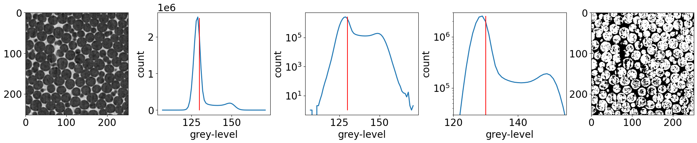

With this little exercise, you might realise two things. First, doing
this for every individual picture of a time serie is time consuming.
Second, and most importantly, manually choosing a threshold may be a
problem for reproducibility of your results. You might choose a
threshold value, but you neighboor might choose another one! How to be
consistent? Is there a method that could give us a reproducible
thresholding result?

The answer is yes! There are many thresholding methods and if you are
currious about them, have a look on the scikit-image website:
`scikit-image - Thresholding
guide <https://scikit-image.org/docs/stable/auto_examples/applications/plot_thresholding_guide.html>`__
However, keep in mind that by choosing a method, you also in a way
introduce a bias in the rest of your quantification pipeline. The
selected method will have an effect on the segmentation result. This is
why, one often perform sensitivity tests or compare methods in order to
increase our confidence in the downstream quantifications. The most
important is to be clear and transparent on your choices.

**The Otsu’s method**

One classical thresholding methods is called the Otsu’s method, named
after Nobuyuki Otsu `Wikipedia - Otsu’s
method <https://en.wikipedia.org/wiki/Otsu's_method>`__. It is an
algorithm that returns a threshold that separate optimaly the pixels
grey-values into two classes (here corresponding to our two phases). It
does this by finding the optimal intra-class variance. The foamquant
function we are going to use, **PhaseSegmentation_Batch**, simply wrapps
up many segmentation functions already available in the scikit-image
library, including the Otsu’s method `scikit-image -
Otsu <https://scikit-image.org/docs/stable/api/skimage.filters.rank.html#skimage.filters.rank.otsu>`__.

We are going to use a “Batch” function that will process our whole time
serie in one go: **PhaseSegmentation_Batch**. This function basically
apply the **PhaseSegmentation** function inside a loop, load and save
the result image at the given directory.

.. code:: ipython3

    # Name and directory where we want to save our phase segmented images
    dirphaseseg = 'P2_PhaseSegmented/'
    namephaseseg = 'PhaseSegmented_'
    
    # Indexes of the images of our time-series (we are working here with 10 subsequent images of the same foam sample, evolving over time).
    imrange = [1,2,3,4,5,6,7,8,9,10]
    
    # Otsu simple threshold phase segmentation of the whole series
    Otsu_th =PhaseSegmentation_Batch(nameraw, namephaseseg,
                            dirraw, dirphaseseg,
                            imrange,
                            method='ostu_global',
                            returnOtsu=True,
                            verbose=True,
                            n0=3,
                            endread='.tiff',
                            endsave='.tiff')
    
    # Print the threshold values
    print('The 10 Otsu thresholds that were used to segment our 10 images:\n',np.asarray(Otsu_th))

.. parsed-literal::

    PhaseSegmented_ 1: done
    
    PhaseSegmented_ 2: done
    
    PhaseSegmented_ 3: done
    
    PhaseSegmented_ 4: done
    
    PhaseSegmented_ 5: done
    
    PhaseSegmented_ 6: done
    
    PhaseSegmented_ 7: done
    
    PhaseSegmented_ 8: done
    
    PhaseSegmented_ 9: done
    
    PhaseSegmented_ 10: done
    
    The 10 Otsu thresholds that were used to segment our 10 images:
     [137 140 138 141 141 141 143 143 139 139]

How does these values look compared to what you got manually? Let’s have
a look at the first image of the serie, before and after this automated
phase-segmentation.

.. code:: ipython3

    # read the first phase-segmented image of the serie
    FirstSegIm = imread(dirphaseseg+namephaseseg+strindex(1, n0=3)+'.tiff')
    
    # raw image orthogonal cuts figure
    Cut3D(FirstRawIm, 
          showcuts=True, 
          nameaxes=['z','y','x'], 
          figblocksize=4,
          zcut=50,       
          ycut=False,    
          cmap='gray')
    
    # phase-segmented image orthogonal cuts figure
    Cut3D(FirstSegIm, 
          showcuts=True, 
          nameaxes=['z','y','x'], 
          figblocksize=4,
          zcut=50,       
          ycut=False,    
          cmap='gray')

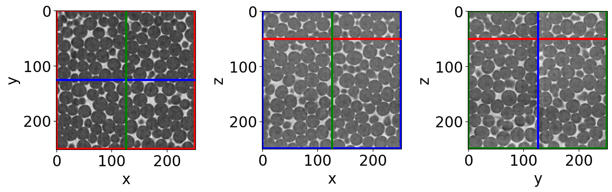

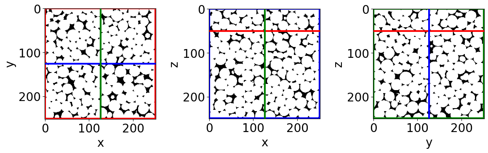

Let’s have a closer look

.. code:: ipython3

    # the same as above, just done on cropped volumes 
    Cut3D(FirstRawIm[50:100,100:150,100:150], 
          nameaxes=['z','y','x'],
          figblocksize=4)
    
    Cut3D(FirstSegIm[50:100,100:150,100:150], 
          nameaxes=['z','y','x'],
          figblocksize=4)

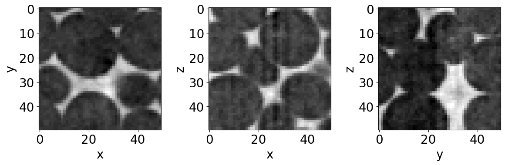

.. image:: Jupy_FoamQuant_Processing_files/Jupy_FoamQuant_Processing_17_1.png

Can you see the black voxel in the very middle of a bubble on the
right-hand size figure? This voxel is definitively not a pixel
corresponding to the liquid phase, and still is assigned a ‘0’ value.
These artefacts (speckles) are common when using a thresholding
segmentation method, and are often due to noise in the raw image. Can
you see the slighty brighter voxels in the corresponding raw image?

E) Cleaning the speckles
------------------------

In this section, we are going to clean our phase-segmented images from
speckles artefacts. Black and white speckles are often refered as holes
and objects respectively.

Once again we are going to run this procedure to the whole time serie
with the “Batch” function **RemoveSpeckleBin_Batch**. Again, it is just
wrapping some scikit-image functions. If you want more information on
the **remove_objects** function, have a look here `scikit-image - Remove
objects <https://scikit-image.org/docs/stable/auto_examples/features_detection/plot_remove_objects.html>`__.

**RemoveSpeckleBin_Batch** remove all the spekles (starting with the
objects, then with the holes) with the following criteria:

:raw-latex:`\begin{equation}
    V_{obj} \leq C_{obj}  \max(V_{obj}(t=0))
\end{equation}` :raw-latex:`\begin{equation}
    V_{hole} \leq C_{hole}  \max(V_{hole}(t=0))
\end{equation}`

With :math:`V_{obj}` and :math:`V_{hole}` the volume of any connected
object or holes. :math:`C_{obj}` and :math:`C_{hole}` are two
coefficients one has to fix. The maximum volumes are only estimated in
the first image and then reused for the rest of the time series.

Once again, prior knowledge on what we are looking at helps us in this
cleaning work. Liquid foam is made of a contunious liquid phase.
Moreover, since the soap films are too small to be spatially resolved.
As a result, liquid foam appear open, as if there is no liquid between
each pair or neighbooring bubble. From these two information, the image
of this liquid foam should consist only of two regions: a unique hole
corresponding to the liquid phase, and a unique region corresponding to
the “image-limitation-continuous” gas phase.

Therefore, if we are confident with this assumption, we can set quite
large values for :math:`C_{obj}` and :math:`C_{hole}`. Let’s set them at
0.1 (10 % of the largest volume). We should obtain 1 hole and 1 object
per volume.

.. code:: ipython3

    # Name and directory where we want to save our cleaned images
    dircleaned = 'P3_Cleaned/'
    namecleaned = 'Cleaned_'
    
    # remove holes and objects
    RemoveSpeckleBin_Batch(namephaseseg, 
                           namecleaned, 
                           dirphaseseg, 
                           dircleaned, 
                           imrange, 
                           verbose=True, 
                           endread='.tiff', 
                           endsave='.tiff', 
                           n0=3, 
                           Cobj=0.1,  # tune this parrameter if you wish
                           Chole=0.1) # tune this parrameter if you wish

.. parsed-literal::

    Before: Nobj 9
    After: Nobj 1
    Before: Nhol 20
    After: Nhol 1
    First image (vox): maxObj 13524383 maxHole 2351568
    Thresholds (vox): thrObj 1352438 thrHole 235157 
    
    Before: Nobj 9
    After: Nobj 1
    Before: Nhol 20
    After: Nhol 1
    Cleaned_001: done
    
    Before: Nobj 6
    After: Nobj 1
    Before: Nhol 21
    After: Nhol 1
    Cleaned_002: done
    
    Before: Nobj 9
    After: Nobj 1
    Before: Nhol 26
    After: Nhol 1
    Cleaned_003: done
    
    Before: Nobj 8
    After: Nobj 1
    Before: Nhol 28
    After: Nhol 1
    Cleaned_004: done
    
    Before: Nobj 3
    After: Nobj 1
    Before: Nhol 22
    After: Nhol 1
    Cleaned_005: done
    
    Before: Nobj 4
    After: Nobj 1
    Before: Nhol 41
    After: Nhol 1
    Cleaned_006: done
    
    Before: Nobj 8
    After: Nobj 1
    Before: Nhol 19
    After: Nhol 1
    Cleaned_007: done
    
    Before: Nobj 6
    After: Nobj 1
    Before: Nhol 23
    After: Nhol 1
    Cleaned_008: done
    
    Before: Nobj 1

.. parsed-literal::

    /gpfs/offline1/staff/tomograms/users/flosch/Rheometer_Jupyter/Jupy_FoamQuant/FoamQuant/Process.py:205: UserWarning: Only one label was provided to `remove_small_objects`. Did you mean to use a boolean array?
      image = remove_small_objects(label(image), min_size=Vminobj)

.. parsed-literal::

    After: Nobj 1
    Before: Nhol 19
    After: Nhol 1
    Cleaned_009: done
    
    Before: Nobj 8
    After: Nobj 1
    Before: Nhol 26
    After: Nhol 1
    Cleaned_010: done
    

Let’s see if it worked, is the black speckle still here?

.. code:: ipython3

    # read the first cleaned image of the serie
    FirstCleanedIm = imread(dircleaned+namecleaned+strindex(1, n0=3)+'.tiff')
    
    # phase-segmented image orthogonal cuts figure
    Cut3D(FirstSegIm[50:100,100:150,100:150], 
          nameaxes=['z','y','x'],
          figblocksize=4)
    
    # cleaned image orthogonal cuts figure
    Cut3D(FirstCleanedIm[50:100,100:150,100:150], 
          nameaxes=['z','y','x'],
          figblocksize=4)

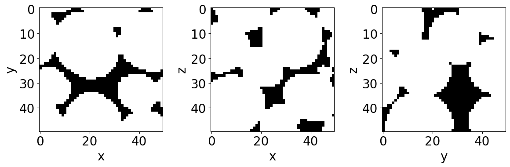

Pretty good!

We are now ready for the next step, another segmentation: the bubble
segmentation.

F) Bubble segmentation
----------------------

Liquid foam is made of gas bubbles in close contact, resulting
effectively in a discontinuous gas phase dispersed inside a continuous
liquid matrix. As mentioned above, since the film separating the bubbles
are too thin for the spatial resolution (with a thickness :math:`\sim`
10 nm - 1 :math:`\mu`\ m, and a 2.75 :math:`\mu`\ m voxel size), the
bubbles do not appear separated in the images.

The films geometric information are lost and should be recovered (their
approximates) based on the remaining geometric information in the image
(the liquid channels and verteces).

There are many methods to segment regions based on geometrical criteria
`scikit-image -
Segmentation <https://scikit-image.org/docs/stable/api/skimage.segmentation.html#module-skimage.segmentation>`__.
Fortunately, a classical segmentation method called **watershed** is
perfectly adaped to our problem. It allows to segment adjacent regions
(such as touching/overlapping spheres) based on a propagation of labels
(integers) from seeds. These seeds in our images are identified as the
maximum distance peaks inside the gas-phase (white region) from any
liquid-phase voxels (black region).

Let’s start by performing this segmentation manually, step by step, to
understand how it works.

**Little exercice: understading the step-by-step watershed segmentation
on the first image of the series**

Try to read though the following code-cell. Do not hesitate to modify
parrameters and run again this cell to see what it changes in the
resulting bubble-segmented image.

.. code:: ipython3

    # Let's work with a subvolume of the first cleaned image, to see more closely what is happening
    ExerciseImage = FirstCleanedIm[50:100,100:150,100:150]
    
    # We start by computing the distance-map: 
    # For each white voxel, the Euclidean distance to the closest black voxel is computed. 
    # The returned result is what we call a distance-map, an image containing all these distance measures saved in form of an image.
    Distmap = ndimage.distance_transform_edt(ExerciseImage)
    
    # The distance-map maximums are effectively the voxels being the further away from any black voxel surrounding it. 
    # Since the bubbles are quite spherical, each of the bubble have in their volume like a "distance-map conical mount". 
    # The mount might however not have a unique maximum. It can be a like a young mountain, sharp with many smaller peaks at its top. 
    # We however want to identify one bubble for a given "moun" and not each of these "peaks". 
    # A simple way to resolve this problem is by "erroding a bit these mounts". We are going to smooth them with a Gaussian filter, with the standard deviation kernel sigma=2.
    SmoothDistmap = ski.filters.gaussian(Distmap, sigma=2)
    
    # Find the maximum from the smoothed distance map, including the maximum at the edge of the image
    local_max_coord = ski.feature.peak_local_max(SmoothDistmap, exclude_border=False)
    
    # Create a '0'-background image filled with '1' where the maximums are.
    local_max_im = np.zeros(np.shape(ExerciseImage))
    for locmax in local_max_coord:
        local_max_im[locmax[0],locmax[1],locmax[2]] = 1
    # Then label each of these '1' voxels by assigning them a integer label ("name"): '1','2','3',...,'N'
    local_max_im_labelled = ndimage.label(local_max_im)[0]
    
    # Apply the watershed algorithm that will fill up ("with water") the flipped smoothed distance map landscape from the local-max "sources-points" (also called seeds), 
    # thi until the whole image is filled. Each puctual label is spread and at the end every bubble (if it worked well) is filled with a region made of a unique label.
    labelled_im = ski.segmentation.watershed(image = -SmoothDistmap, 
                                             markers = local_max_im_labelled, 
                                             mask = ExerciseImage, 
                                             watershed_line=False)

.. code:: ipython3

    fig, axes = plt.subplots(1, 6, figsize=(6*4, 4), constrained_layout=True)
    
    # First cleaned image (z-cross-section at z = 25 vox)
    axes[0].imshow(ExerciseImage[25], cmap='gray')
    axes[0].set_title('Cleaned cropped image', fontsize=15)
    
    # Distance map (z-cross-section at z = 25 vox)
    axes[1].imshow(Distmap[25], cmap='viridis')
    axes[1].set_title('Distance map', fontsize=15)
    
    # Smoothed distance map (z-cross-section at z = 25 vox)
    axes[2].imshow(SmoothDistmap[25], cmap='viridis')
    axes[2].set_title('Smoothed distance map', fontsize=15)
    
    # Projection view of the cleaned image with the identified maximums
    axes[3].imshow(np.sum(ExerciseImage,0), cmap='gray')
    for coord in local_max_coord:
        axes[3].plot(coord[2],coord[1],'xr')
    axes[3].set_title('Projection: maximum coordinates', fontsize=15)
    
    # Projection view of the 0-background / 1-maximum image
    axes[4].imshow(np.sum(local_max_im,0), cmap='gray')
    axes[4].set_title('Projection: 0-background, 1-maximum', fontsize=15)
    
    # Create a random colormap to see the different bubbles
    rcmap = RandomCmap(100,verbose=False)
    # Bubble-segmented image (z-cross-section at z = 25 vox)
    axes[5].imshow(labelled_im[25], cmap=rcmap)
    axes[5].set_title('Bubble segmented', fontsize=15)

.. parsed-literal::

    Text(0.5, 1.0, 'Bubble segmented')

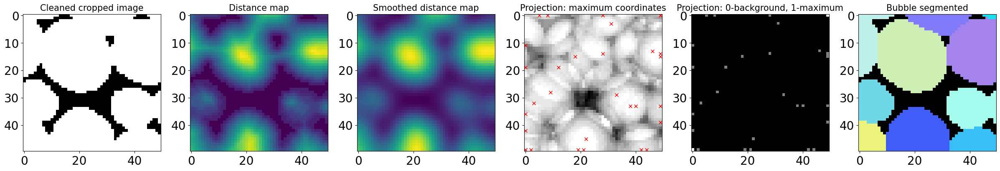

**Run bubble-segmentation on the whole time-series**

Now that we understand a bit more how the watershed segmentation works,
and see which parrameters works well, we can go back to our time serie
and process it in one go with the **BubbleSegmentation_Batch** function.
It wraps-up the steps shown above with some more parrameters, for
example for the filtration of the seeds or the type of watershed. It
also include the ITKwatershed included in the SPAM package `SPAM -
ITKwatershed <https://www.spam-project.dev/docs/spam.label.html#module-spam.label.ITKwatershed>`__.
Try **help(BubbleSegmentation_Batch)** if you want to see and try them.

.. code:: ipython3

    # Name and directory where we want to save our bubble-segmented images
    dirbubbleseg = 'P4_BubbleSegmented/'
    namebubbleseg = 'BubbleSeg_'
    
    # Segment the bubbles with default parrameters 
    # for more parrameters, try help(BubbleSegmentation_Batch)
    BubbleSegmentation_Batch(namecleaned, 
                             namebubbleseg, 
                             dircleaned, 
                             dirbubbleseg, 
                             imrange, 
                             verbose=True, 
                             endread='.tiff', 
                             endsave='.tiff', 
                             ITK = True,   #Use the ITK watershed from SPAM
                             Binning = 2,  #To reduce the run-time, one can chose to bin the image, here every block of 2x2x2 voxels -> 1 voxel
                             n0=3)

.. parsed-literal::

    Path exist: True
    BubbleSeg_001: done
    
    BubbleSeg_002: done
    
    BubbleSeg_003: done
    
    BubbleSeg_004: done
    
    BubbleSeg_005: done
    
    BubbleSeg_006: done
    
    BubbleSeg_007: done
    
    BubbleSeg_008: done
    
    BubbleSeg_009: done
    
    BubbleSeg_010: done
    

To distinguish each individual bubble in the image, we are going to use
a random color map. It has by default a black background and here we
choose to extend it in the range of 1 to 5000 integer values.

.. code:: ipython3

    # Since we are now looking at more bubbles let's create a "larger" random colormap: here 5000 random colors
    rcmap = RandomCmap(5000)

.. parsed-literal::

    Number of labels: 5000

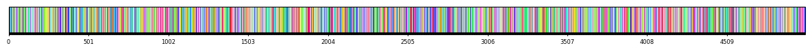

Let’s read the first bubble-segmented (also called labelled) image of
the series. First notice the effect of the binning. The image appear
much more pixelized.

How do the bubbles look like? Are they “well” segmented? It is possible
to have over- or under-segmentation of the bubbles, i.e. a too fine or
too coarse segmentation of their volumes. This is due to the finding of
too many or too few local maximum in the distance map. It can be
sometimes tricky to remove absolutely all of them, and we will see in a
next tutorials (Region properties and Tracking) how to disregard them.

.. code:: ipython3

    # Read the first image of the series
    Lab = imread(dirbubbleseg+namebubbleseg+strindex(1, 3)+'.tiff')
    # Show a 3D-cut view of the volume
    Cut3D(Lab,  
          nameaxes=['z','y','x'],
          cmap=rcmap, 
          interpolation='nearest', 
          figblocksize=4)

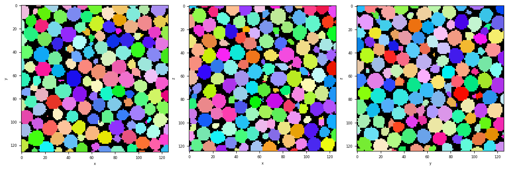

G) Remove the edge bubbles
--------------------------

The bubbles at the edges of the images are irrelevant for further
quantifications. They are “cut” so for exampe have a smaller volume than
in reality. To resolve this problem, we decide to remove these labels
from our images when at least one of their voxel touch the edge of the
image.

.. code:: ipython3

    # Name and directory where we want to save our bubble-no-edge images
    dirnoedge = 'P5_BubbleNoEdge/'
    namenoedge = 'BubbleNoEdge_'
    
    RemoveEdgeBubble_Batch(namebubbleseg, 
                           namenoedge, 
                           dirbubbleseg, 
                           dirnoedge, 
                           imrange, 
                           verbose=True, 
                           endread='.tiff', 
                           endsave='.tiff', 
                           n0=3,  
                           Masktype=[False,False])

.. parsed-literal::

    Path exist: True
    BubbleNoEdge_001: done
    
    BubbleNoEdge_002: done
    
    BubbleNoEdge_003: done
    
    BubbleNoEdge_004: done
    
    BubbleNoEdge_005: done
    
    BubbleNoEdge_006: done
    
    BubbleNoEdge_007: done
    
    BubbleNoEdge_008: done
    
    BubbleNoEdge_009: done
    
    BubbleNoEdge_010: done
    

.. code:: ipython3

    # Read the first image of the series
    Lab = imread(dirnoedge+namenoedge+strindex(1, 3)+'.tiff')
    # Show a 3D-cut view of the volume
    Cut3D(Lab,  
          nameaxes=['z','y','x'],
          cmap=rcmap, 
          interpolation='nearest', 
          figblocksize=4)

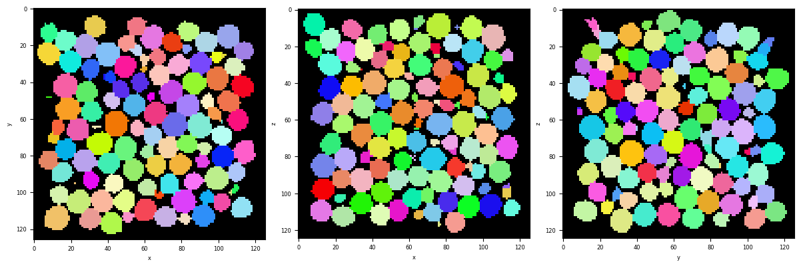

H) Summary
----------

Let’s now quickly summarize the processing steps we have done and have
by the same occasion a chek on the whole time-series.

**CutSerie** is an interesting tool to plot the cross-section of an
image over time. Indicate the directory, the name of your image and the
range of index.

.. code:: ipython3

    selectrange = imrange[0:10:2]
    
    CutSerie(directory = 'P1_Raw/',
             name = 'Raw_',
             imrange=selectrange, 
             figblocksize=3, 
             title='Raw_',
             Ncolumns=len(selectrange))
    
    CutSerie(directory = 'P2_PhaseSegmented/',
             name = 'PhaseSegmented_',
             imrange=selectrange, 
             figblocksize=3, 
             title='PhaseSegmented_',
             Ncolumns=len(selectrange))
    
    CutSerie(directory = 'P3_Cleaned/',
             name = 'Cleaned_',
             imrange=selectrange, 
             figblocksize=3, 
             title='Cleaned_',
             Ncolumns=len(selectrange))
    
    CutSerie(directory = 'P4_BubbleSegmented/',
             name = 'BubbleSeg_',
             imrange=selectrange, 
             figblocksize=3, 
             title='BubbleSeg_',
             Ncolumns=len(selectrange), 
             cmap=rcmap)
    
    CutSerie(directory = 'P5_BubbleNoEdge/',
             name = 'BubbleNoEdge_',
             imrange=selectrange, 
             figblocksize=3, 
             title='BubbleNoEdge_',
             Ncolumns=len(selectrange), 
             cmap=rcmap)

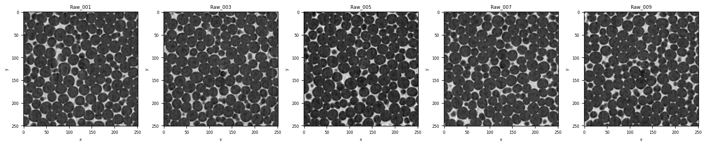

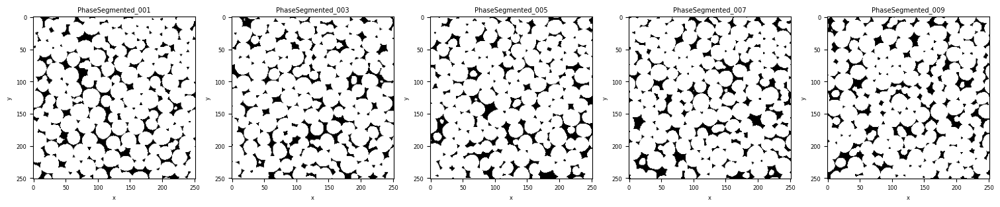

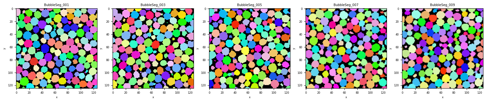

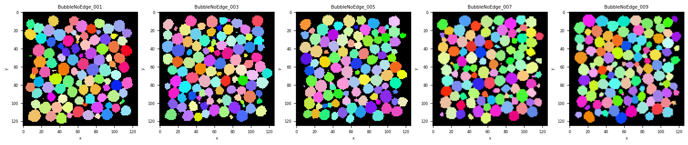

You have now completed this tutorial. I hope it has been helpfull to
you. Go back to `FoamQuant -
Examples <https://foamquant.readthedocs.io/en/latest/examples.html>`__
for more examples and tutorials.
