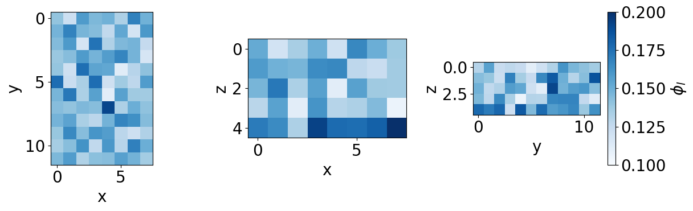
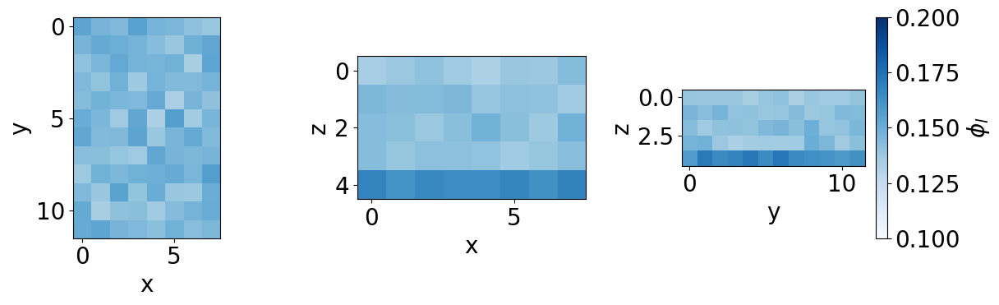
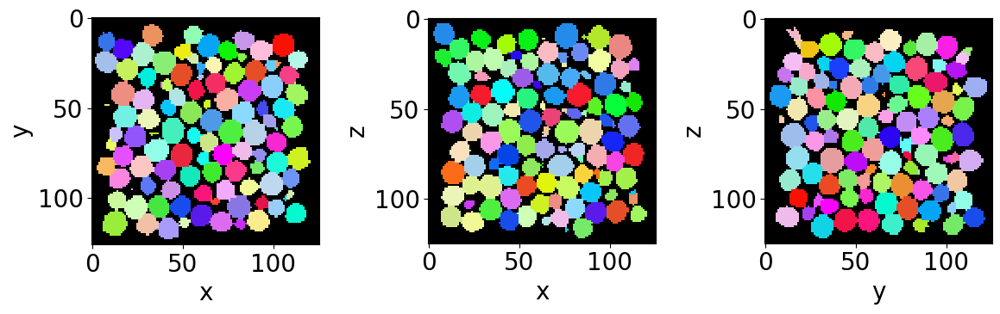
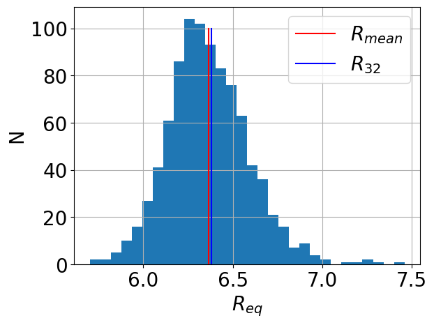

Flowing liquid foam - Liquid fraction & Bubble equivalent radius
================================================================

In this tutorial you will learn to measure liquid fraction and individual bubble radius from respectively phase-segmented (cleaned) and bubble segmented (no-edge) images.
^^^^^^^^^^^^^^^^^^^^^^^^^^^^^^^^^^^^^^^^^^^^^^^^^^^^^^^^^^^^^^^^^^^^^^^^^^^^^^^^^^^^^^^^^^^^^^^^^^^^^^^^^^^^^^^^^^^^^^^^^^^^^^^^^^^^^^^^^^^^^^^^^^^^^^^^^^^^^^^^^^^^^^^^^^

The tutorial is divided in the following sections:
^^^^^^^^^^^^^^^^^^^^^^^^^^^^^^^^^^^^^^^^^^^^^^^^^^

::

   A) Import libraries
   B) Quantification folders
   C) Get familiar with the input data
   D) Liquid fraction
   E) Get familiar with the input data
   F) Individual bubble properties
   G) Remove bubbles at the edges
   H) Equivalent radius distribution

A) Import libraries
===================

.. code:: ipython3

    from FoamQuant import *
    import numpy as np
    import os
    import matplotlib.pyplot as plt; plt.rc('font', size=20) 
    from tifffile import imread
    import pickle as pkl
    import pandas as pd

B) Quantification folders
=========================

.. code:: ipython3

    # Processing folders names
    Quant_Folder = ['Q1_LiqFrac_Glob','Q2_LiqFrac_Cartesian','Q3_Bubble_Prop']
    
    # Create the quantification folders (where we are going to save our results)
    for Pi in Quant_Folder:
        if  os.path.exists(Pi):
            print('path already exist:',Pi)
        else:
            print('Created folder:',Pi)
            os.mkdir(Pi)

.. parsed-literal::

    path already exist: Q1_LiqFrac_Glob
    path already exist: Q2_LiqFrac_Cartesian
    path already exist: Q3_Bubble_Prop

C) Get familiar with the input data
===================================

.. code:: ipython3

    # Name and directory of the speckle-cleaned images
    dircleaned = 'P3_Cleaned/'
    namecleaned = 'Cleaned_'
    
    # Read the first image of the series
    str_index = strindex(1, n0=3)
    print('The string index suffix: ', str_index)
    fullname = dircleaned+namecleaned+str_index+'.tiff'
    print('The full directory+name: ', fullname)
    
    FirstCleanIm = imread(fullname)

.. parsed-literal::

    The string index suffix:  001
    The full directory+name:  P3_Cleaned/Cleaned_001.tiff

.. code:: ipython3

    # Show a 3D-cut view of the volume
    Cut3D(FirstCleanIm, 
          showcuts=True, # Shows the red, blue and green cuts.
          nameaxes=['z','y','x'], # Shows the name of the axes, here z,y,x.
          figblocksize=4,# This parrameter gives the size of the produced figure (here 4*3 along the horizontal,  along the vertical).
          cmap='gray')   # The default colormap used by this function is 'gray' but can be modified here.

.. parsed-literal::

    /gpfs/offline1/staff/tomograms/users/flosch/Rheometer_Jupyter/Jupy_FoamQuant/FoamQuant/Figure.py:90: UserWarning: The figure layout has changed to tight
      plt.tight_layout()

.. image:: Jupy_FoamQuant_lf_radius_files/Jupy_FoamQuant_lf_radius_7_1.png

D) Liquid fraction
==================

The liquid fraction is an essential parrameter when studying liquid
foam. It is quantified from the phase-segmented images, as the number of
liquid phase voxels divided by the total number of voxels inside a given
volume:

:raw-latex:`\begin{equation}
    \phi_\ell = \frac{N_l}{N_l+N_g}
\end{equation}`

where :math:`N_l` and :math:`N_g` are the liquid and gas volumes
respectively in number of voxels.

Full-image liquid fraction
--------------------------

Here we want to know how the full image liquid fraction evolves with
time.

.. code:: ipython3

    # Name and directory where we are going to save the global liquid fractions
    dir_lf_glob = 'Q1_LiqFrac_Glob/'
    name_lf_glob = 'LiqFrac_Glob_'
    
    # Indexes of the images of our time-series (we are working here with 10 subsequent images of the same foam sample, evolving over time).
    imrange = [1,2,3,4,5,6,7,8,9,10]
    
    # Liquid fraction function
    LiqFrac_Batch(namecleaned, 
                  name_lf_glob, 
                  dircleaned, 
                  dir_lf_glob, 
                  imrange, 
                  TypeGrid='Global', # <- a single value per image
                  verbose=True, 
                  Masktype = [False, False])

.. parsed-literal::

    Path exist: True
    LiqFrac_Glob_001: done
    LiqFrac_Glob_002: done
    LiqFrac_Glob_003: done
    LiqFrac_Glob_004: done
    LiqFrac_Glob_005: done
    LiqFrac_Glob_006: done
    LiqFrac_Glob_007: done
    LiqFrac_Glob_008: done
    LiqFrac_Glob_009: done
    LiqFrac_Glob_010: done

.. code:: ipython3

    # Read the global liquid fractions
    List_lf_Global = []
    for timei in imrange:
        with open(dir_lf_glob + name_lf_glob + strindex(timei, n0=3) + '.pkl','rb') as file:
            lf_Global = pkl.load(file)['lf']
            List_lf_Global.append(lf_Global)
    
    print('Global liquid fraction as a function of time:\n', np.asarray(List_lf_Global))

.. parsed-literal::

    Global liquid fraction as a function of time:
     [0.14812106 0.14536508 0.14993783 0.14911722 0.14338045 0.14822921
     0.14275831 0.14482527 0.14253219 0.14275472]

Liquid fraction along a cartesian grid
--------------------------------------

Now we want to know how the liquid fraction is distributed in space. We
are going to use the same function but indicate that we want a cartesian
mesh output **TypeGrid=‘CartesMesh’**.

.. code:: ipython3

    # Name and directory where we are going to save the cartesian-grid liquid fractions
    dir_lf_car = 'Q2_LiqFrac_Cartesian/'
    name_lf_car = 'LiqFrac_Cartesian_'
    
    # Get liquid fraction in cartesian subvolumes
    # (volume percentage of liquid in each subvolumes)
    LiqFrac_Batch(namecleaned, 
                  name_lf_car, 
                  dircleaned, 
                  dir_lf_car, 
                  imrange, 
                  TypeGrid='CartesMesh', # <- a cartesian grid of liquid fractions
                  Nz=5,                  # Indicates the number of boxes along z
                  Ny=12,                 # ...along y
                  Nx=8,                  # ...along x
                  verbose=1,
                  structured=True,
                  Masktype = [False, False]) # <- can be turned on for cylindrical masking around the axis of rotation and in the perriphery

.. parsed-literal::

    Path exist: True
    LiqFrac_Cartesian_001: done
    LiqFrac_Cartesian_002: done
    LiqFrac_Cartesian_003: done
    LiqFrac_Cartesian_004: done
    LiqFrac_Cartesian_005: done
    LiqFrac_Cartesian_006: done
    LiqFrac_Cartesian_007: done
    LiqFrac_Cartesian_008: done
    LiqFrac_Cartesian_009: done
    LiqFrac_Cartesian_010: done

.. code:: ipython3

    # Read all the Cartesian mesh liquid fractions
    List_lf_Car = []
    for timei in imrange:
        with open(dir_lf_car + name_lf_car + strindex(timei, n0=3) + '.pkl','rb') as file:
            lf_Car = pkl.load(file)['lf']
            List_lf_Car.append(lf_Car)

.. code:: ipython3

    # Result shape: Number of images / Nz / Ny / Nx
    np.shape(List_lf_Car)

.. parsed-literal::

    (10, 5, 12, 8)

We now gonna represent the liquid fraction field with the same figure
tool that we used for observing our images: **Cut3D**.

.. code:: ipython3

    # Orthogonal cut view of the liquid fraction field obtained from the first image of the series 
    fig,ax,neg = Cut3D(List_lf_Car[0],
                       nameaxes=['z','y','x'],
                       cmap='Blues',
                       vmin=0.10,
                       vmax=0.20,
                       returnfig=True,
                       figblocksize=4)
    fig.colorbar(neg[2], label=r'$\phi_l$')

.. parsed-literal::

    vmin = 0.1 vmax = 0.2

.. parsed-literal::

    <matplotlib.colorbar.Colorbar at 0x152da66465a0>

The orthogonal cuts can be seen with **Cut3D**. The orthogonal
projection view can be seen with **Proj3D**. The projections are
averages.

.. code:: ipython3

    # Orthogonal projection view of the time-averaged liquid fraction field
    lf_time_average = np.mean(List_lf_Car,0)
    fig,ax,neg = Proj3D(lf_time_average,
                        nameaxes=['z','y','x'],
                        cmap='Blues',
                        vmin=0.10,
                        vmax=0.20,
                        returnfig=True,
                        figblocksize=4)
    fig.colorbar(neg[2], label=r'$\phi_l$')

.. parsed-literal::

    vmin = 0.1 vmax = 0.2

.. parsed-literal::

    /gpfs/offline1/staff/tomograms/users/flosch/Rheometer_Jupyter/Jupy_FoamQuant/FoamQuant/Figure.py:160: UserWarning: The figure layout has changed to tight
      plt.tight_layout()

.. parsed-literal::

    <matplotlib.colorbar.Colorbar at 0x152d9c56b680>

E) Get familiar with the input data
===================================

Let’s read the first bubble-segmented image of the series (with no
bubble on the edges).

.. code:: ipython3

    # Name and directory where the bubble segmented images are saved
    dirnoedge = 'P5_BubbleNoEdge/'
    namenoedge = 'BubbleNoEdge_'
    
    # Read the first image of the series
    Lab = imread(dirnoedge+namenoedge+strindex(1, 3)+'.tiff')
    
    # Since we are now looking at more bubbles let's create a "larger" random colormap: here 500 random colors
    rcmap = RandomCmap(500, verbose=False)
    
    # Show a 3D-cut view of the volume
    Cut3D(Lab,  
          nameaxes=['z','y','x'],
          cmap=rcmap, 
          interpolation='nearest', 
          figblocksize=4)

F) Individual bubble properties (RegProps)
==========================================

We want here to extract from each bubble region, its equivalent radius.
To do so we are going to use the **RegionProp_Batch** function. It is
essentially a wrapped of **regionprops** from scikit-image.

.. code:: ipython3

    # Name and directory where we are going to save the bubble region properties
    dir_Bubble_prop = 'Q3_Bubble_Prop/'
    name_Bubble_prop = 'Bubble_Prop_'
    
    RegionProp_Batch(namenoedge,
                     name_Bubble_prop,
                     dirnoedge,
                     dir_Bubble_prop,
                     imrange,
                     verbose=True,
                     endread='.tiff', 
                     endsave='.tsv')

.. parsed-literal::

    Path exist: True
    Bubble_Prop_001: done
    Bubble_Prop_002: done
    Bubble_Prop_003: done
    Bubble_Prop_004: done
    Bubble_Prop_005: done
    Bubble_Prop_006: done
    Bubble_Prop_007: done
    Bubble_Prop_008: done
    Bubble_Prop_009: done
    Bubble_Prop_010: done

G) Equivalent radius
====================

Let’s open the first saved bubble-properties table with **pandas**.

.. code:: ipython3

    df = pd.read_csv(dir_Bubble_prop+name_Bubble_prop+strindex(1,n0=3)+'.tsv',sep = '\t')
    display(df)

.. raw:: html

    

    
    <table border="1" class="dataframe">
      <thead>
        <tr style="text-align: right;">
          <th></th>
          <th>lab</th>
          <th>z</th>
          <th>y</th>
          <th>x</th>
          <th>vol</th>
          <th>rad</th>
          <th>area</th>
          <th>sph</th>
          <th>volfit</th>
          <th>S1</th>
          <th>...</th>
          <th>e2y</th>
          <th>e2x</th>
          <th>e3z</th>
          <th>e3y</th>
          <th>e3x</th>
          <th>U1</th>
          <th>U2</th>
          <th>U3</th>
          <th>U</th>
          <th>type</th>
        </tr>
      </thead>
      <tbody>
        <tr>
          <th>0</th>
          <td>1</td>
          <td>6.661077</td>
          <td>57.085613</td>
          <td>65.375993</td>
          <td>1133.0</td>
          <td>6.467162</td>
          <td>529.207274</td>
          <td>0.998627</td>
          <td>1142.398114</td>
          <td>6.237956</td>
          <td>...</td>
          <td>6.728715</td>
          <td>0.117552</td>
          <td>-0.107005</td>
          <td>0.117552</td>
          <td>6.388462</td>
          <td>-0.038838</td>
          <td>-0.019058</td>
          <td>0.057897</td>
          <td>0.088518</td>
          <td>-1</td>
        </tr>
        <tr>
          <th>1</th>
          <td>2</td>
          <td>7.576789</td>
          <td>85.936300</td>
          <td>50.280105</td>
          <td>1146.0</td>
          <td>6.491803</td>
          <td>533.385277</td>
          <td>0.997801</td>
          <td>1154.519766</td>
          <td>6.243540</td>
          <td>...</td>
          <td>6.682162</td>
          <td>-0.069400</td>
          <td>-0.082819</td>
          <td>-0.069400</td>
          <td>6.303276</td>
          <td>-0.041462</td>
          <td>-0.033346</td>
          <td>0.074808</td>
          <td>0.112432</td>
          <td>-1</td>
        </tr>
        <tr>
          <th>2</th>
          <td>3</td>
          <td>7.570736</td>
          <td>87.444767</td>
          <td>108.598837</td>
          <td>1032.0</td>
          <td>6.268982</td>
          <td>497.047442</td>
          <td>0.998908</td>
          <td>1040.301280</td>
          <td>6.071228</td>
          <td>...</td>
          <td>6.154835</td>
          <td>-0.116499</td>
          <td>0.204781</td>
          <td>-0.116499</td>
          <td>6.264697</td>
          <td>-0.034724</td>
          <td>-0.016820</td>
          <td>0.051543</td>
          <td>0.078854</td>
          <td>-1</td>
        </tr>
        <tr>
          <th>3</th>
          <td>4</td>
          <td>8.201754</td>
          <td>15.444444</td>
          <td>68.452242</td>
          <td>1026.0</td>
          <td>6.256809</td>
          <td>496.236802</td>
          <td>0.997505</td>
          <td>1035.571103</td>
          <td>5.810319</td>
          <td>...</td>
          <td>6.192980</td>
          <td>-0.266247</td>
          <td>0.174190</td>
          <td>-0.266247</td>
          <td>6.173020</td>
          <td>-0.077130</td>
          <td>0.026566</td>
          <td>0.050564</td>
          <td>0.117547</td>
          <td>1</td>
        </tr>
        <tr>
          <th>4</th>
          <td>5</td>
          <td>7.827060</td>
          <td>16.074262</td>
          <td>110.963377</td>
          <td>983.0</td>
          <td>6.168151</td>
          <td>484.463256</td>
          <td>0.997458</td>
          <td>998.865323</td>
          <td>5.807303</td>
          <td>...</td>
          <td>5.948497</td>
          <td>-0.218520</td>
          <td>-0.176608</td>
          <td>-0.218520</td>
          <td>6.147211</td>
          <td>-0.065620</td>
          <td>-0.006864</td>
          <td>0.072484</td>
          <td>0.120043</td>
          <td>-1</td>
        </tr>
        <tr>
          <th>...</th>
          <td>...</td>
          <td>...</td>
          <td>...</td>
          <td>...</td>
          <td>...</td>
          <td>...</td>
          <td>...</td>
          <td>...</td>
          <td>...</td>
          <td>...</td>
          <td>...</td>
          <td>...</td>
          <td>...</td>
          <td>...</td>
          <td>...</td>
          <td>...</td>
          <td>...</td>
          <td>...</td>
          <td>...</td>
          <td>...</td>
          <td>...</td>
        </tr>
        <tr>
          <th>909</th>
          <td>910</td>
          <td>116.492625</td>
          <td>18.975418</td>
          <td>46.282203</td>
          <td>1017.0</td>
          <td>6.238461</td>
          <td>492.277318</td>
          <td>0.997594</td>
          <td>1023.339198</td>
          <td>5.845628</td>
          <td>...</td>
          <td>6.323806</td>
          <td>-0.043935</td>
          <td>-0.116745</td>
          <td>-0.043935</td>
          <td>6.269451</td>
          <td>-0.067111</td>
          <td>-0.000255</td>
          <td>0.067366</td>
          <td>0.116461</td>
          <td>-1</td>
        </tr>
        <tr>
          <th>910</th>
          <td>911</td>
          <td>115.678241</td>
          <td>65.150463</td>
          <td>84.888889</td>
          <td>864.0</td>
          <td>5.908470</td>
          <td>441.002150</td>
          <td>0.999271</td>
          <td>869.881179</td>
          <td>5.697289</td>
          <td>...</td>
          <td>6.089410</td>
          <td>0.036148</td>
          <td>0.032631</td>
          <td>0.036148</td>
          <td>5.939960</td>
          <td>-0.038658</td>
          <td>0.003756</td>
          <td>0.034902</td>
          <td>0.063953</td>
          <td>1</td>
        </tr>
        <tr>
          <th>911</th>
          <td>912</td>
          <td>116.231437</td>
          <td>104.715526</td>
          <td>42.981678</td>
          <td>1037.0</td>
          <td>6.279090</td>
          <td>500.232203</td>
          <td>0.999165</td>
          <td>1050.719468</td>
          <td>6.109016</td>
          <td>...</td>
          <td>6.577079</td>
          <td>-0.077785</td>
          <td>-0.035127</td>
          <td>-0.077785</td>
          <td>6.228199</td>
          <td>-0.031840</td>
          <td>-0.012748</td>
          <td>0.044588</td>
          <td>0.068896</td>
          <td>-1</td>
        </tr>
        <tr>
          <th>912</th>
          <td>913</td>
          <td>117.108756</td>
          <td>16.835023</td>
          <td>25.201843</td>
          <td>1085.0</td>
          <td>6.374513</td>
          <td>513.848344</td>
          <td>0.997691</td>
          <td>1091.492266</td>
          <td>6.052830</td>
          <td>...</td>
          <td>6.305141</td>
          <td>0.006104</td>
          <td>-0.192089</td>
          <td>0.006104</td>
          <td>6.123454</td>
          <td>-0.053770</td>
          <td>-0.020379</td>
          <td>0.074150</td>
          <td>0.114923</td>
          <td>-1</td>
        </tr>
        <tr>
          <th>913</th>
          <td>914</td>
          <td>116.961499</td>
          <td>56.852077</td>
          <td>76.185410</td>
          <td>987.0</td>
          <td>6.176506</td>
          <td>483.276857</td>
          <td>0.998231</td>
          <td>996.355518</td>
          <td>5.830325</td>
          <td>...</td>
          <td>5.887434</td>
          <td>0.144950</td>
          <td>-0.079210</td>
          <td>0.144950</td>
          <td>6.206381</td>
          <td>-0.060825</td>
          <td>0.007427</td>
          <td>0.053398</td>
          <td>0.099545</td>
          <td>1</td>
        </tr>
      </tbody>
    </table>
    
914 rows × 26 columns

    

Now we can plot, for example, the bubble equivalent radius distribution,
the mean radius and Sauter radius.

.. code:: ipython3

    # Equivalent radius distribution
    df['rad'].hist(bins=30)
    
    #Mean radius
    Rmean = np.mean(df['rad'])
    plt.plot([Rmean,Rmean],[0,100],'r-', label=r'$R_{mean}$')
    #Mean Sauter radius
    R32 = np.sum(np.power(df['rad'],3))/np.sum(np.power(df['rad'],2))
    plt.plot([R32,R32],[0,100],'b-', label=r'$R_{32}$')
    
    plt.xlabel(r'$R_{eq}$')
    plt.ylabel('N')
    plt.legend()

.. parsed-literal::

    <matplotlib.legend.Legend at 0x152d9c588cb0>

You have now completed this tutorial. I hope it has been helpfull to
you. Go back to `FoamQuant -
Examples <https://foamquant.readthedocs.io/en/latest/examples.html>`__
for more examples and tutorials.
