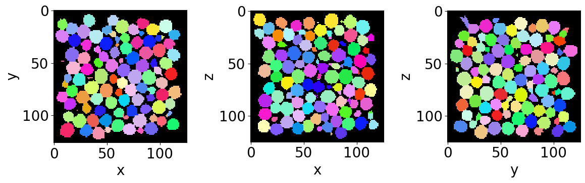
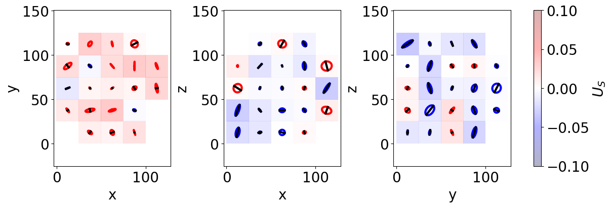
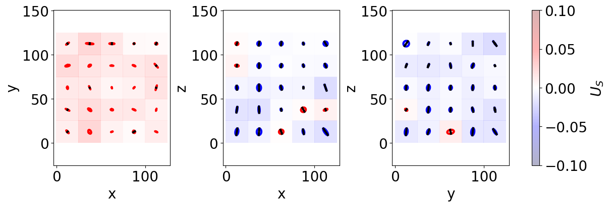
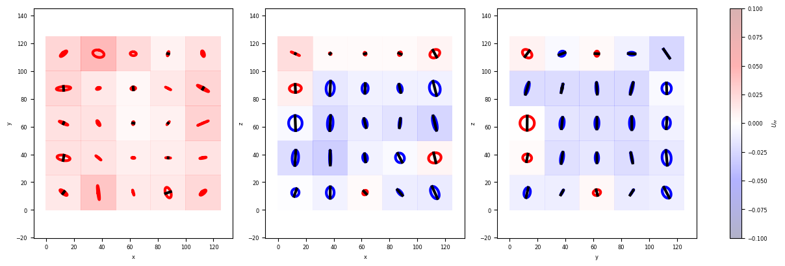
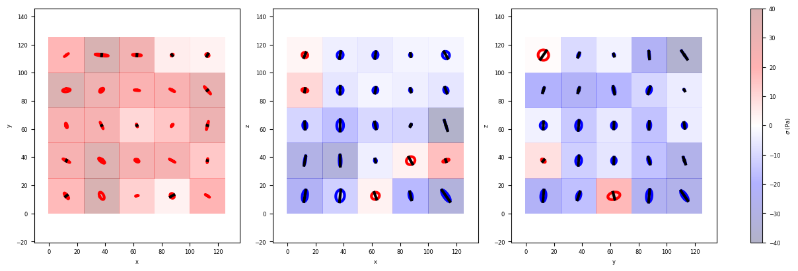

Flowing liquid foam - Strain & Stress fields
============================================

In this tutorial you will learn to measure liquid fraction and individual bubble radius from respectively phase-segmented (cleaned) and bubble segmented (no-edge) images.
^^^^^^^^^^^^^^^^^^^^^^^^^^^^^^^^^^^^^^^^^^^^^^^^^^^^^^^^^^^^^^^^^^^^^^^^^^^^^^^^^^^^^^^^^^^^^^^^^^^^^^^^^^^^^^^^^^^^^^^^^^^^^^^^^^^^^^^^^^^^^^^^^^^^^^^^^^^^^^^^^^^^^^^^^^

The tutorial is divided in the following sections:
^^^^^^^^^^^^^^^^^^^^^^^^^^^^^^^^^^^^^^^^^^^^^^^^^^

::

   A) Import libraries
   B) Quantification folders
   C) Get familiar with the input data
   D) Strain - Shape tensor
   E) Strain - Texture tensor
   F) Stress - Batchelor tensor

A) Import libraries
===================

.. code:: ipython3

    from FoamQuant import *
    import numpy as np
    import skimage as ski 
    import os
    import matplotlib.pyplot as plt; plt.rc('font', size=20) 
    from tifffile import imread
    from scipy import ndimage
    import pickle as pkl
    import pandas as pd

B) Quantification folders
=========================

.. code:: ipython3

    # Processing folders names
    Quant_Folder = ['Q3_Bubble_Prop','Q4_Topology','Q5_Texture','Q6_Stress']
    
    # Create the quantification folders (where we are going to save our results)
    for Pi in Quant_Folder:
        if  os.path.exists(Pi):
            print('path already exist:',Pi)
        else:
            print('Created folder:',Pi)
            os.mkdir(Pi)

.. parsed-literal::

    path already exist: Q3_Bubble_Prop
    path already exist: Q4_Topology
    path already exist: Q5_Texture
    path already exist: Q6_Stress

Let’s read the first bubble-segmented image of the series (with no
bubble on the edges).

C) Get familiar with the input data
===================================

.. code:: ipython3

    # Name and directory of  the no-edge bubble segmented images
    dirnoedge = 'P5_BubbleNoEdge/'
    namenoedge = 'BubbleNoEdge_'
    
    # Read the first image of the series
    Lab = imread(dirnoedge+namenoedge+strindex(1, 3)+'.tiff')
    
    # Since we are now looking at more bubbles let's create a "larger" random colormap: here 500 random colors
    rcmap = RandomCmap(500, verbose=False)
    
    # Show a 3D-cut view of the volume
    Cut3D(Lab,  
          nameaxes=['z','y','x'],
          cmap=rcmap, 
          interpolation='nearest', 
          figblocksize=4)

.. parsed-literal::

    /gpfs/offline1/staff/tomograms/users/flosch/Rheometer_Jupyter/Jupy_FoamQuant/FoamQuant/Figure.py:90: UserWarning: The figure layout has changed to tight
      plt.tight_layout()

D) Strain - Measured from the bubble region (shape tensor)
==========================================================

The shape strain tensor :math:`U_S` is computed from the shape tensor
:math:`S`. Each bubble is represented by a set of coordinates
{:math:`\textbf{r}`} of all the voxels defining its region in the image.
From this set can be defined both the center of mass coordinates,
:math:`\langle \textbf{r} \rangle`, and the shape tensor as

:raw-latex:`\begin{equation}
    \textbf{S}=\langle(\textbf{r}-\langle \textbf{r} \rangle)  \otimes (\textbf{r}-\langle \textbf{r} \rangle)\rangle^{1/2}
\end{equation}`

The strain tensors :math:`\textbf{U}_\textbf{S}` is derived from
:math:`\textbf{S}` as the deviation from an isotropic shape
:math:`\mathbf{S_0}` state (a perfect sphere):
:raw-latex:`\begin{equation}
    \textbf{U}_\textbf{S} =   \log(\textbf{S}) - \log(\mathbf{S_0}) 
\end{equation}`

with :math:`\mathbf{S_0} = S_0 \textbf{Id}` and :math:`\textbf{Id}` the
identity tensor. The isotropic state is build from the three shape
tensor eigenvalues :math:`\lambda_i` as
:math:`S_0 = (\lambda_1 \lambda_2 \lambda_3)^{1/3}`.

The shape tensor is already included in the saved properties by the
**RegionProp_Batch** function.

.. code:: ipython3

    # Name and directory where we are going to save the bubble region properties
    dir_Bubble_prop = 'Q3_Bubble_Prop/'
    name_Bubble_prop = 'Bubble_Prop_'
    
    # Indexes of the images of our time-series (we are working here with 10 subsequent images of the same foam sample, evolving over time).
    imrange = [1,2,3,4,5,6,7,8,9,10]
    
    RegionProp_Batch(namenoedge,
                     name_Bubble_prop,
                     dirnoedge,
                     dir_Bubble_prop,
                     imrange,
                     verbose=True,
                     endread='.tiff',
                     endsave='.tsv')

.. parsed-literal::

    Path exist: True
    Bubble_Prop_001: done
    Bubble_Prop_002: done
    Bubble_Prop_003: done
    Bubble_Prop_004: done
    Bubble_Prop_005: done
    Bubble_Prop_006: done
    Bubble_Prop_007: done
    Bubble_Prop_008: done
    Bubble_Prop_009: done
    Bubble_Prop_010: done

Let’s open the first saved bubble-properties table with **pandas**.

.. code:: ipython3

    df = pd.read_csv(dir_Bubble_prop+name_Bubble_prop+strindex(1,n0=3)+'.tsv',sep = '\t')
    display(df)

.. raw:: html

    

    
    <table border="1" class="dataframe">
      <thead>
        <tr style="text-align: right;">
          <th></th>
          <th>lab</th>
          <th>z</th>
          <th>y</th>
          <th>x</th>
          <th>vol</th>
          <th>rad</th>
          <th>area</th>
          <th>sph</th>
          <th>volfit</th>
          <th>S1</th>
          <th>...</th>
          <th>e2y</th>
          <th>e2x</th>
          <th>e3z</th>
          <th>e3y</th>
          <th>e3x</th>
          <th>U1</th>
          <th>U2</th>
          <th>U3</th>
          <th>U</th>
          <th>type</th>
        </tr>
      </thead>
      <tbody>
        <tr>
          <th>0</th>
          <td>1</td>
          <td>6.661077</td>
          <td>57.085613</td>
          <td>65.375993</td>
          <td>1133.0</td>
          <td>6.467162</td>
          <td>529.207274</td>
          <td>0.998627</td>
          <td>1142.398114</td>
          <td>6.237956</td>
          <td>...</td>
          <td>6.728715</td>
          <td>0.117552</td>
          <td>-0.107005</td>
          <td>0.117552</td>
          <td>6.388462</td>
          <td>-0.038838</td>
          <td>-0.019058</td>
          <td>0.057897</td>
          <td>0.088518</td>
          <td>-1</td>
        </tr>
        <tr>
          <th>1</th>
          <td>2</td>
          <td>7.576789</td>
          <td>85.936300</td>
          <td>50.280105</td>
          <td>1146.0</td>
          <td>6.491803</td>
          <td>533.385277</td>
          <td>0.997801</td>
          <td>1154.519766</td>
          <td>6.243540</td>
          <td>...</td>
          <td>6.682162</td>
          <td>-0.069400</td>
          <td>-0.082819</td>
          <td>-0.069400</td>
          <td>6.303276</td>
          <td>-0.041462</td>
          <td>-0.033346</td>
          <td>0.074808</td>
          <td>0.112432</td>
          <td>-1</td>
        </tr>
        <tr>
          <th>2</th>
          <td>3</td>
          <td>7.570736</td>
          <td>87.444767</td>
          <td>108.598837</td>
          <td>1032.0</td>
          <td>6.268982</td>
          <td>497.047442</td>
          <td>0.998908</td>
          <td>1040.301280</td>
          <td>6.071228</td>
          <td>...</td>
          <td>6.154835</td>
          <td>-0.116499</td>
          <td>0.204781</td>
          <td>-0.116499</td>
          <td>6.264697</td>
          <td>-0.034724</td>
          <td>-0.016820</td>
          <td>0.051543</td>
          <td>0.078854</td>
          <td>-1</td>
        </tr>
        <tr>
          <th>3</th>
          <td>4</td>
          <td>8.201754</td>
          <td>15.444444</td>
          <td>68.452242</td>
          <td>1026.0</td>
          <td>6.256809</td>
          <td>496.236802</td>
          <td>0.997505</td>
          <td>1035.571103</td>
          <td>5.810319</td>
          <td>...</td>
          <td>6.192980</td>
          <td>-0.266247</td>
          <td>0.174190</td>
          <td>-0.266247</td>
          <td>6.173020</td>
          <td>-0.077130</td>
          <td>0.026566</td>
          <td>0.050564</td>
          <td>0.117547</td>
          <td>1</td>
        </tr>
        <tr>
          <th>4</th>
          <td>5</td>
          <td>7.827060</td>
          <td>16.074262</td>
          <td>110.963377</td>
          <td>983.0</td>
          <td>6.168151</td>
          <td>484.463256</td>
          <td>0.997458</td>
          <td>998.865323</td>
          <td>5.807303</td>
          <td>...</td>
          <td>5.948497</td>
          <td>-0.218520</td>
          <td>-0.176608</td>
          <td>-0.218520</td>
          <td>6.147211</td>
          <td>-0.065620</td>
          <td>-0.006864</td>
          <td>0.072484</td>
          <td>0.120043</td>
          <td>-1</td>
        </tr>
        <tr>
          <th>...</th>
          <td>...</td>
          <td>...</td>
          <td>...</td>
          <td>...</td>
          <td>...</td>
          <td>...</td>
          <td>...</td>
          <td>...</td>
          <td>...</td>
          <td>...</td>
          <td>...</td>
          <td>...</td>
          <td>...</td>
          <td>...</td>
          <td>...</td>
          <td>...</td>
          <td>...</td>
          <td>...</td>
          <td>...</td>
          <td>...</td>
          <td>...</td>
        </tr>
        <tr>
          <th>909</th>
          <td>910</td>
          <td>116.492625</td>
          <td>18.975418</td>
          <td>46.282203</td>
          <td>1017.0</td>
          <td>6.238461</td>
          <td>492.277318</td>
          <td>0.997594</td>
          <td>1023.339198</td>
          <td>5.845628</td>
          <td>...</td>
          <td>6.323806</td>
          <td>-0.043935</td>
          <td>-0.116745</td>
          <td>-0.043935</td>
          <td>6.269451</td>
          <td>-0.067111</td>
          <td>-0.000255</td>
          <td>0.067366</td>
          <td>0.116461</td>
          <td>-1</td>
        </tr>
        <tr>
          <th>910</th>
          <td>911</td>
          <td>115.678241</td>
          <td>65.150463</td>
          <td>84.888889</td>
          <td>864.0</td>
          <td>5.908470</td>
          <td>441.002150</td>
          <td>0.999271</td>
          <td>869.881179</td>
          <td>5.697289</td>
          <td>...</td>
          <td>6.089410</td>
          <td>0.036148</td>
          <td>0.032631</td>
          <td>0.036148</td>
          <td>5.939960</td>
          <td>-0.038658</td>
          <td>0.003756</td>
          <td>0.034902</td>
          <td>0.063953</td>
          <td>1</td>
        </tr>
        <tr>
          <th>911</th>
          <td>912</td>
          <td>116.231437</td>
          <td>104.715526</td>
          <td>42.981678</td>
          <td>1037.0</td>
          <td>6.279090</td>
          <td>500.232203</td>
          <td>0.999165</td>
          <td>1050.719468</td>
          <td>6.109016</td>
          <td>...</td>
          <td>6.577079</td>
          <td>-0.077785</td>
          <td>-0.035127</td>
          <td>-0.077785</td>
          <td>6.228199</td>
          <td>-0.031840</td>
          <td>-0.012748</td>
          <td>0.044588</td>
          <td>0.068896</td>
          <td>-1</td>
        </tr>
        <tr>
          <th>912</th>
          <td>913</td>
          <td>117.108756</td>
          <td>16.835023</td>
          <td>25.201843</td>
          <td>1085.0</td>
          <td>6.374513</td>
          <td>513.848344</td>
          <td>0.997691</td>
          <td>1091.492266</td>
          <td>6.052830</td>
          <td>...</td>
          <td>6.305141</td>
          <td>0.006104</td>
          <td>-0.192089</td>
          <td>0.006104</td>
          <td>6.123454</td>
          <td>-0.053770</td>
          <td>-0.020379</td>
          <td>0.074150</td>
          <td>0.114923</td>
          <td>-1</td>
        </tr>
        <tr>
          <th>913</th>
          <td>914</td>
          <td>116.961499</td>
          <td>56.852077</td>
          <td>76.185410</td>
          <td>987.0</td>
          <td>6.176506</td>
          <td>483.276857</td>
          <td>0.998231</td>
          <td>996.355518</td>
          <td>5.830325</td>
          <td>...</td>
          <td>5.887434</td>
          <td>0.144950</td>
          <td>-0.079210</td>
          <td>0.144950</td>
          <td>6.206381</td>
          <td>-0.060825</td>
          <td>0.007427</td>
          <td>0.053398</td>
          <td>0.099545</td>
          <td>1</td>
        </tr>
      </tbody>
    </table>
    
914 rows × 26 columns

    

Let’s keep the shape tensor tensor columns

.. code:: ipython3

    #Shape tensor
    df[['e1z','e1y','e1x',
        'e2z','e2y','e2x',
        'e3z','e3y','e3x']]

.. raw:: html

    

    
    <table border="1" class="dataframe">
      <thead>
        <tr style="text-align: right;">
          <th></th>
          <th>e1z</th>
          <th>e1y</th>
          <th>e1x</th>
          <th>e2z</th>
          <th>e2y</th>
          <th>e2x</th>
          <th>e3z</th>
          <th>e3y</th>
          <th>e3x</th>
        </tr>
      </thead>
      <tbody>
        <tr>
          <th>0</th>
          <td>6.354887</td>
          <td>-0.211241</td>
          <td>-0.107005</td>
          <td>-0.211241</td>
          <td>6.728715</td>
          <td>0.117552</td>
          <td>-0.107005</td>
          <td>0.117552</td>
          <td>6.388462</td>
        </tr>
        <tr>
          <th>1</th>
          <td>6.565883</td>
          <td>0.368782</td>
          <td>-0.082819</td>
          <td>0.368782</td>
          <td>6.682162</td>
          <td>-0.069400</td>
          <td>-0.082819</td>
          <td>-0.069400</td>
          <td>6.303276</td>
        </tr>
        <tr>
          <th>2</th>
          <td>6.450833</td>
          <td>-0.076502</td>
          <td>0.204781</td>
          <td>-0.076502</td>
          <td>6.154835</td>
          <td>-0.116499</td>
          <td>0.204781</td>
          <td>-0.116499</td>
          <td>6.264697</td>
        </tr>
        <tr>
          <th>3</th>
          <td>6.491207</td>
          <td>0.206515</td>
          <td>0.174190</td>
          <td>0.206515</td>
          <td>6.192980</td>
          <td>-0.266247</td>
          <td>0.174190</td>
          <td>-0.266247</td>
          <td>6.173020</td>
        </tr>
        <tr>
          <th>4</th>
          <td>6.537665</td>
          <td>0.134854</td>
          <td>-0.176608</td>
          <td>0.134854</td>
          <td>5.948497</td>
          <td>-0.218520</td>
          <td>-0.176608</td>
          <td>-0.218520</td>
          <td>6.147211</td>
        </tr>
        <tr>
          <th>...</th>
          <td>...</td>
          <td>...</td>
          <td>...</td>
          <td>...</td>
          <td>...</td>
          <td>...</td>
          <td>...</td>
          <td>...</td>
          <td>...</td>
        </tr>
        <tr>
          <th>909</th>
          <td>6.189208</td>
          <td>0.396155</td>
          <td>-0.116745</td>
          <td>0.396155</td>
          <td>6.323806</td>
          <td>-0.043935</td>
          <td>-0.116745</td>
          <td>-0.043935</td>
          <td>6.269451</td>
        </tr>
        <tr>
          <th>910</th>
          <td>5.744228</td>
          <td>-0.123420</td>
          <td>0.032631</td>
          <td>-0.123420</td>
          <td>6.089410</td>
          <td>0.036148</td>
          <td>0.032631</td>
          <td>0.036148</td>
          <td>5.939960</td>
        </tr>
        <tr>
          <th>911</th>
          <td>6.124738</td>
          <td>-0.024406</td>
          <td>-0.035127</td>
          <td>-0.024406</td>
          <td>6.577079</td>
          <td>-0.077785</td>
          <td>-0.035127</td>
          <td>-0.077785</td>
          <td>6.228199</td>
        </tr>
        <tr>
          <th>912</th>
          <td>6.761401</td>
          <td>0.199871</td>
          <td>-0.192089</td>
          <td>0.199871</td>
          <td>6.305141</td>
          <td>0.006104</td>
          <td>-0.192089</td>
          <td>0.006104</td>
          <td>6.123454</td>
        </tr>
        <tr>
          <th>913</th>
          <td>6.514460</td>
          <td>-0.001779</td>
          <td>-0.079210</td>
          <td>-0.001779</td>
          <td>5.887434</td>
          <td>0.144950</td>
          <td>-0.079210</td>
          <td>0.144950</td>
          <td>6.206381</td>
        </tr>
      </tbody>
    </table>
    
914 rows × 9 columns

    

Individual bubbles are often highly deformed in what looks like random
deformations. In order to extract the strain field of the structure,
without this local “noize”, we spatially average the shape of the bubble
inside boxes. Only after averaging, the average strain is computed from
the average shape tensor.

First, let’s reshape our table in form of two lists: a list for the
centroid coordinates and one for the shape tensors.

.. code:: ipython3

    LCoord = np.asarray(df[['z','y','x']])
    
    numpy_shape = np.asarray(df[['e1z','e1y','e1x',
                                 'e2z','e2y','e2x',
                                 'e3z','e3y','e3x']])
    LShape=[]
    for bbli in range(len(numpy_shape)):
        LShape.append(numpy_shape[bbli].reshape(3,3))

Now that we have the data in this format, one can perform a
cartesian-grid average. Here we choose to have 5x5x5 boxes over the
pixel coordinates [0,125] along z,y and x. We choose to return the
result in a structured format.

.. code:: ipython3

    Grids, CoordGrd, ShapeAVG, ShapeSTD, ShapeCount = Grid_Tavg(LCoord, 
                                                                LShape, 
                                                                Range = [0,125,0,125,0,125],
                                                                N=[5,5,5], 
                                                                NanFill=True, #<- if no bubble in a box, fill with a nan value
                                                                structured=True)

.. code:: ipython3

    # Averaged shape tensor in the fist [0,0,0] box
    ShapeAVG[0][0][0]

.. parsed-literal::

    array([[ 6.29865145,  0.1757332 , -0.1352297 ],
           [ 0.1757332 ,  6.16544328,  0.16994142],
           [-0.1352297 ,  0.16994142,  6.30239316]])

.. code:: ipython3

    # The associated strain tensor
    USfromS(ShapeAVG[0][0][0])

.. parsed-literal::

    array([[ 0.00696853,  0.02851242, -0.0218597 ],
           [ 0.02851242, -0.01455694,  0.02758429],
           [-0.0218597 ,  0.02758429,  0.00758841]])

To have a bit more a feeling of this strain tensor field, one can use
the following representation, using ellipses. If you wish to learn about
this representation, have a look at the following paper:
`Three-dimensional liquid foam flow through a hopper resolved by fast
X-ray
microtomography <https://pubs.rsc.org/en/content/articlelanding/2023/sm/d2sm01299e>`__.
**CutTensor3D** work similarly than **Cut3D**. It represents the three
orthogonal cuts of the tensorial space.

.. code:: ipython3

    CutTensor3D(Grids,
                CoordGrd,
                ShapeAVG, 
                ShapeCount,
                scale_factor = 150,
                figblocksize=4,
                vmin=-0.1,
                vmax=0.1,
                Countmin=5, #<- shows a symbol if there is al least 5 bubble in the average box
                showscale=False,
                nameaxes=['z','y','x'],
                DeviatoricType=2, #<- 2 for dealing with shape: Shape -> Strain
                colorbarlab=r'$U_S$') 

.. parsed-literal::

    Normal min/max ax0 -0.014492509196547583 0.033930867715730055
    Normal min/max ax1 -0.032242297648117375 0.010851178749433667
    Normal min/max ax2 -0.03491523459848728 0.019630372984758657

We can also do the same for the whole time-resolved data. Since we have
only a small number of bubbles, it is going to smooth a bit the
dentencies. In addition we can use **ProjTensor3D**, which average even
more along the whole volume.

.. code:: ipython3

    # Take into acount the whole time serie data
    LLCoord=[]
    LLShape=[]
    for imi in range(len(imrange)):
        df = pd.read_csv(dir_Bubble_prop+name_Bubble_prop+strindex(imrange[imi],n0=3)+'.tsv',sep = '\t')
    
        LCoord = np.asarray(df[['z','y','x']])
    
        numpy_shape = np.asarray(df[['e1z','e1y','e1x',
                                     'e2z','e2y','e2x',
                                     'e3z','e3y','e3x']])
        LShape=[]
        for bbli in range(len(numpy_shape)):
            LShape.append(numpy_shape[bbli].reshape(3,3))
    
        LLCoord.append(LCoord)
        LLShape.append(LShape)
    
    Grids_2, CoordGrd_2, ShapeAVG_2, ShapeSTD_2, ShapeCount_2 = Grid_Tavg(np.concatenate(LLCoord), 
                                                                np.concatenate(LLShape), 
                                                                Range = [0,125,0,125,0,125],
                                                                N=[5,5,5], 
                                                                NanFill=True,
                                                                verbose=False,
                                                                structured=True)

.. code:: ipython3

    ProjTensor3D(Grids_2,
                CoordGrd_2,
                ShapeAVG_2, 
                ShapeCount_2,
                scale_factor = 150,
                figblocksize=4,
                vmin=-0.1,
                vmax=0.1,
                Countmin=5,
                showscale=False,
                nameaxes=['z','y','x'],
                DeviatoricType=2, #<- 2 for dealing with shape: Shape -> Strain
                colorbarlab=r'$U_S$')

.. parsed-literal::

    Normal min/max ax0 0.0024188430575035006 0.025238664552525682
    Normal min/max ax1 -0.021390368960705185 0.009303289768458225
    Normal min/max ax2 -0.022187499174558964 0.010575788442407356

E) Strain - Measured from the distance between neighbooring bubbles (texture tensor)
====================================================================================

We can now do the exact same steps, extracting the strain field but
working with the texture tensor.

Each bubble is also characterized by a set of link vectors
{:math:`\mathbf{l}`} between its center and the neighboring bubble
centers. The texture tensor associated to each bubble is defined as

:raw-latex:`\begin{equation}
    \textbf{M}=\langle \mathbf{l}  \otimes \mathbf{l} \rangle
\end{equation}` with :math:`\langle ... \rangle` the average over the
set of neighboring bubbles.

The strain tensor :math:`\textbf{U}_\textbf{M}` is derived from
:math:`\textbf{M}` as the deviation from an isotropic texture
:math:`\mathbf{M_0}` state: :raw-latex:`\begin{equation}
    \textbf{U}_\textbf{M} = \frac{1}{2} \left( \log(\textbf{M}) - \log(\mathbf{M_0}) \right)
\end{equation}`

The isotropic texture :math:`\mathbf{M_0}` is constructed in the same
manner. It is important to note that the factor :math:`\frac{1}{2}`
accounts for the difference in dimensionality: the texture tensor has
units of length squared, whereas the shape tensor has units of length.
Note that the texture tensor tends to be less noisy than the shape
tensor in dry foams, but more noisy in wet foams. This was attributed to
the decrease in the average coordination number :math:`Z` and area of
contact :math:`A` between the bubbles when the liquid fraction
:math:`\phi_\ell` increases.

Anyway, let’s get this texture tensor from our images. For this we have
to start by extracting the contact topology between our bubble (which
bubble is in contact with which). We use **GetContacts_Batch** and
indicate that we just want the contact table **save=‘table’**. This
function is wrapping **spam.label.contacts.labelledContacts** from the
SPAM toolbox
`spam.label.contacts.labelledContacts <https://www.spam-project.dev/docs/spam.label.html#module-spam.label.contacts>`__.

.. code:: ipython3

    # Name and directory where we are going to save the contact topology
    dirbubbleseg = 'P4_BubbleSegmented/'
    namebubbleseg = 'BubbleSeg_'
    
    dirnoedge = 'P5_BubbleNoEdge/'
    namenoedge = 'BubbleNoEdge_'
    
    dir_Topo = 'Q4_Topology/'
    name_Topo = 'Topology_'
    
    GetContacts_Batch(namebubbleseg,
                      namenoedge,
                      name_Topo,
                      dirbubbleseg,
                      dirnoedge,
                      dir_Topo,
                      imrange,
                      verbose=True,
                      endread='.tiff',
                      endread_noedge='.tiff',
                      endsave='.tiff',
                      n0=3,
                      save='table', # <- save the topology table
                      maximumCoordinationNumber=20)

.. parsed-literal::

    Path exist: True
    Topology_001: done
    Topology_002: done
    Topology_003: done
    Topology_004: done
    Topology_005: done
    Topology_006: done
    Topology_007: done
    Topology_008: done
    Topology_009: done
    Topology_010: done

The contact table is looking like this, for each central bubble, we get
it’s coordination, and the label of all its neighbooring bubbles.

.. code:: ipython3

    df = pd.read_csv(dir_Topo+name_Topo+'table_'+strindex(1,n0=3)+'.tsv',sep = '\t')
    display(df)

.. raw:: html

    

    
    <table border="1" class="dataframe">
      <thead>
        <tr style="text-align: right;">
          <th></th>
          <th>lab</th>
          <th>lab_noedge</th>
          <th>Z</th>
          <th>z</th>
          <th>y</th>
          <th>x</th>
          <th>lab1</th>
          <th>cont1</th>
          <th>lab2</th>
          <th>cont2</th>
          <th>...</th>
          <th>lab16</th>
          <th>cont16</th>
          <th>lab17</th>
          <th>cont17</th>
          <th>lab18</th>
          <th>cont18</th>
          <th>lab19</th>
          <th>cont19</th>
          <th>lab20</th>
          <th>cont20</th>
        </tr>
      </thead>
      <tbody>
        <tr>
          <th>0</th>
          <td>1</td>
          <td>-1</td>
          <td>2</td>
          <td>1.044118</td>
          <td>0.764706</td>
          <td>4.661765</td>
          <td>10</td>
          <td>1</td>
          <td>130</td>
          <td>10</td>
          <td>...</td>
          <td>0</td>
          <td>0</td>
          <td>0</td>
          <td>0</td>
          <td>0</td>
          <td>0</td>
          <td>0</td>
          <td>0</td>
          <td>0</td>
          <td>0</td>
        </tr>
        <tr>
          <th>1</th>
          <td>2</td>
          <td>-1</td>
          <td>3</td>
          <td>1.394495</td>
          <td>0.917431</td>
          <td>16.908257</td>
          <td>10</td>
          <td>2</td>
          <td>100</td>
          <td>3</td>
          <td>...</td>
          <td>0</td>
          <td>0</td>
          <td>0</td>
          <td>0</td>
          <td>0</td>
          <td>0</td>
          <td>0</td>
          <td>0</td>
          <td>0</td>
          <td>0</td>
        </tr>
        <tr>
          <th>2</th>
          <td>3</td>
          <td>-1</td>
          <td>5</td>
          <td>1.908213</td>
          <td>3.185990</td>
          <td>30.603865</td>
          <td>100</td>
          <td>11</td>
          <td>90</td>
          <td>12</td>
          <td>...</td>
          <td>0</td>
          <td>0</td>
          <td>0</td>
          <td>0</td>
          <td>0</td>
          <td>0</td>
          <td>0</td>
          <td>0</td>
          <td>0</td>
          <td>0</td>
        </tr>
        <tr>
          <th>3</th>
          <td>4</td>
          <td>-1</td>
          <td>4</td>
          <td>2.017241</td>
          <td>1.178161</td>
          <td>43.678161</td>
          <td>105</td>
          <td>4</td>
          <td>90</td>
          <td>13</td>
          <td>...</td>
          <td>0</td>
          <td>0</td>
          <td>0</td>
          <td>0</td>
          <td>0</td>
          <td>0</td>
          <td>0</td>
          <td>0</td>
          <td>0</td>
          <td>0</td>
        </tr>
        <tr>
          <th>4</th>
          <td>5</td>
          <td>-1</td>
          <td>7</td>
          <td>3.012723</td>
          <td>3.937659</td>
          <td>68.585242</td>
          <td>6</td>
          <td>5</td>
          <td>14</td>
          <td>24</td>
          <td>...</td>
          <td>0</td>
          <td>0</td>
          <td>0</td>
          <td>0</td>
          <td>0</td>
          <td>0</td>
          <td>0</td>
          <td>0</td>
          <td>0</td>
          <td>0</td>
        </tr>
        <tr>
          <th>...</th>
          <td>...</td>
          <td>...</td>
          <td>...</td>
          <td>...</td>
          <td>...</td>
          <td>...</td>
          <td>...</td>
          <td>...</td>
          <td>...</td>
          <td>...</td>
          <td>...</td>
          <td>...</td>
          <td>...</td>
          <td>...</td>
          <td>...</td>
          <td>...</td>
          <td>...</td>
          <td>...</td>
          <td>...</td>
          <td>...</td>
          <td>...</td>
        </tr>
        <tr>
          <th>1580</th>
          <td>1581</td>
          <td>-1</td>
          <td>5</td>
          <td>122.629032</td>
          <td>112.225806</td>
          <td>45.118280</td>
          <td>1451</td>
          <td>8080</td>
          <td>1507</td>
          <td>8146</td>
          <td>...</td>
          <td>0</td>
          <td>0</td>
          <td>0</td>
          <td>0</td>
          <td>0</td>
          <td>0</td>
          <td>0</td>
          <td>0</td>
          <td>0</td>
          <td>0</td>
        </tr>
        <tr>
          <th>1581</th>
          <td>1582</td>
          <td>-1</td>
          <td>8</td>
          <td>122.080709</td>
          <td>114.244094</td>
          <td>21.409449</td>
          <td>1440</td>
          <td>8024</td>
          <td>1446</td>
          <td>8026</td>
          <td>...</td>
          <td>0</td>
          <td>0</td>
          <td>0</td>
          <td>0</td>
          <td>0</td>
          <td>0</td>
          <td>0</td>
          <td>0</td>
          <td>0</td>
          <td>0</td>
        </tr>
        <tr>
          <th>1582</th>
          <td>1583</td>
          <td>-1</td>
          <td>4</td>
          <td>123.109091</td>
          <td>119.068182</td>
          <td>9.877273</td>
          <td>1446</td>
          <td>8151</td>
          <td>1465</td>
          <td>8193</td>
          <td>...</td>
          <td>0</td>
          <td>0</td>
          <td>0</td>
          <td>0</td>
          <td>0</td>
          <td>0</td>
          <td>0</td>
          <td>0</td>
          <td>0</td>
          <td>0</td>
        </tr>
        <tr>
          <th>1583</th>
          <td>1584</td>
          <td>-1</td>
          <td>4</td>
          <td>122.367978</td>
          <td>121.452247</td>
          <td>111.960674</td>
          <td>1453</td>
          <td>8084</td>
          <td>1464</td>
          <td>8152</td>
          <td>...</td>
          <td>0</td>
          <td>0</td>
          <td>0</td>
          <td>0</td>
          <td>0</td>
          <td>0</td>
          <td>0</td>
          <td>0</td>
          <td>0</td>
          <td>0</td>
        </tr>
        <tr>
          <th>1584</th>
          <td>1585</td>
          <td>-1</td>
          <td>4</td>
          <td>122.831933</td>
          <td>123.605042</td>
          <td>19.621849</td>
          <td>1441</td>
          <td>8085</td>
          <td>1582</td>
          <td>8247</td>
          <td>...</td>
          <td>0</td>
          <td>0</td>
          <td>0</td>
          <td>0</td>
          <td>0</td>
          <td>0</td>
          <td>0</td>
          <td>0</td>
          <td>0</td>
          <td>0</td>
        </tr>
      </tbody>
    </table>
    
1585 rows × 46 columns

    

This table is perfect for us who want to compute the texture for each
individual central bubble. We can run **Texture_Batch** on the whole
time series.

.. code:: ipython3

    dir_Texture = 'Q5_Texture/'
    name_Texture = 'Texture_'
    
    Texture_Batch(name_Topo+'table_', 
                  name_Texture, 
                  dir_Topo, 
                  dir_Texture, 
                  imrange, 
                  verbose=True, 
                  endsave='.tsv', 
                  n0=3)

.. parsed-literal::

    Path exist: True
    Texture_001: done
    Texture_002: done
    Texture_003: done
    Texture_004: done
    Texture_005: done
    Texture_006: done
    Texture_007: done
    Texture_008: done
    Texture_009: done
    Texture_010: done

The texture table is looking like this, for each central bubble, the
texture tensor is saved in as ‘e1z’,‘e1y’,‘e1x’, …

.. code:: ipython3

    df = pd.read_csv(dir_Texture+name_Texture+strindex(1,n0=3)+'.tsv',sep = '\t')
    display(df)

.. raw:: html

    

    
    <table border="1" class="dataframe">
      <thead>
        <tr style="text-align: right;">
          <th></th>
          <th>lab</th>
          <th>labnoedge</th>
          <th>z</th>
          <th>y</th>
          <th>x</th>
          <th>rad</th>
          <th>M1</th>
          <th>M2</th>
          <th>M3</th>
          <th>e1z</th>
          <th>...</th>
          <th>e2y</th>
          <th>e2x</th>
          <th>e3z</th>
          <th>e3y</th>
          <th>e3x</th>
          <th>U1</th>
          <th>U2</th>
          <th>U3</th>
          <th>U</th>
          <th>type</th>
        </tr>
      </thead>
      <tbody>
        <tr>
          <th>0</th>
          <td>124</td>
          <td>1</td>
          <td>6.661077</td>
          <td>57.085613</td>
          <td>65.375993</td>
          <td>7.133204</td>
          <td>37.827194</td>
          <td>56.830993</td>
          <td>61.279972</td>
          <td>38.579808</td>
          <td>...</td>
          <td>61.235342</td>
          <td>-0.183279</td>
          <td>3.594778</td>
          <td>-0.183279</td>
          <td>56.123009</td>
          <td>-0.148246</td>
          <td>0.055280</td>
          <td>0.092966</td>
          <td>0.224752</td>
          <td>1.0</td>
        </tr>
        <tr>
          <th>1</th>
          <td>134</td>
          <td>2</td>
          <td>7.576789</td>
          <td>85.936300</td>
          <td>50.280105</td>
          <td>7.461774</td>
          <td>44.059647</td>
          <td>60.649529</td>
          <td>64.592785</td>
          <td>44.945604</td>
          <td>...</td>
          <td>62.643796</td>
          <td>1.566565</td>
          <td>-1.132046</td>
          <td>1.566565</td>
          <td>61.712561</td>
          <td>-0.117021</td>
          <td>0.042763</td>
          <td>0.074258</td>
          <td>0.177638</td>
          <td>1.0</td>
        </tr>
        <tr>
          <th>2</th>
          <td>135</td>
          <td>3</td>
          <td>7.570736</td>
          <td>87.444767</td>
          <td>108.598837</td>
          <td>7.301112</td>
          <td>37.709848</td>
          <td>56.996941</td>
          <td>70.473813</td>
          <td>40.525263</td>
          <td>...</td>
          <td>60.505996</td>
          <td>-7.574228</td>
          <td>6.475036</td>
          <td>-7.574228</td>
          <td>64.149343</td>
          <td>-0.173066</td>
          <td>0.033472</td>
          <td>0.139594</td>
          <td>0.275387</td>
          <td>1.0</td>
        </tr>
        <tr>
          <th>3</th>
          <td>140</td>
          <td>4</td>
          <td>8.201754</td>
          <td>15.444444</td>
          <td>68.452242</td>
          <td>6.980503</td>
          <td>35.581607</td>
          <td>52.467487</td>
          <td>61.973267</td>
          <td>36.868127</td>
          <td>...</td>
          <td>55.344881</td>
          <td>-5.217910</td>
          <td>2.044747</td>
          <td>-5.217910</td>
          <td>57.809353</td>
          <td>-0.157207</td>
          <td>0.036976</td>
          <td>0.120231</td>
          <td>0.246586</td>
          <td>1.0</td>
        </tr>
        <tr>
          <th>4</th>
          <td>141</td>
          <td>5</td>
          <td>7.827060</td>
          <td>16.074262</td>
          <td>110.963377</td>
          <td>6.710914</td>
          <td>35.794983</td>
          <td>45.327214</td>
          <td>56.300072</td>
          <td>39.443306</td>
          <td>...</td>
          <td>54.719208</td>
          <td>-0.982686</td>
          <td>4.626722</td>
          <td>-0.982686</td>
          <td>43.259756</td>
          <td>-0.114831</td>
          <td>0.003219</td>
          <td>0.111613</td>
          <td>0.196166</td>
          <td>1.0</td>
        </tr>
        <tr>
          <th>...</th>
          <td>...</td>
          <td>...</td>
          <td>...</td>
          <td>...</td>
          <td>...</td>
          <td>...</td>
          <td>...</td>
          <td>...</td>
          <td>...</td>
          <td>...</td>
          <td>...</td>
          <td>...</td>
          <td>...</td>
          <td>...</td>
          <td>...</td>
          <td>...</td>
          <td>...</td>
          <td>...</td>
          <td>...</td>
          <td>...</td>
          <td>...</td>
        </tr>
        <tr>
          <th>909</th>
          <td>1448</td>
          <td>910</td>
          <td>116.492625</td>
          <td>18.975418</td>
          <td>46.282203</td>
          <td>6.894339</td>
          <td>39.451829</td>
          <td>49.992341</td>
          <td>54.448413</td>
          <td>42.386839</td>
          <td>...</td>
          <td>49.820392</td>
          <td>-0.258594</td>
          <td>-5.110580</td>
          <td>-0.258594</td>
          <td>51.685353</td>
          <td>-0.093160</td>
          <td>0.025234</td>
          <td>0.067926</td>
          <td>0.144549</td>
          <td>1.0</td>
        </tr>
        <tr>
          <th>910</th>
          <td>1449</td>
          <td>911</td>
          <td>115.678241</td>
          <td>65.150463</td>
          <td>84.888889</td>
          <td>6.935705</td>
          <td>37.118709</td>
          <td>49.212623</td>
          <td>60.936069</td>
          <td>41.971782</td>
          <td>...</td>
          <td>47.532116</td>
          <td>3.415575</td>
          <td>7.336506</td>
          <td>3.415575</td>
          <td>57.763503</td>
          <td>-0.129622</td>
          <td>0.011392</td>
          <td>0.118230</td>
          <td>0.215325</td>
          <td>1.0</td>
        </tr>
        <tr>
          <th>911</th>
          <td>1451</td>
          <td>912</td>
          <td>116.231437</td>
          <td>104.715526</td>
          <td>42.981678</td>
          <td>6.811419</td>
          <td>38.967329</td>
          <td>48.282142</td>
          <td>53.080899</td>
          <td>39.773145</td>
          <td>...</td>
          <td>47.922429</td>
          <td>-1.370797</td>
          <td>0.274048</td>
          <td>-1.370797</td>
          <td>52.634795</td>
          <td>-0.087239</td>
          <td>0.019930</td>
          <td>0.067308</td>
          <td>0.137140</td>
          <td>1.0</td>
        </tr>
        <tr>
          <th>912</th>
          <td>1456</td>
          <td>913</td>
          <td>117.108756</td>
          <td>16.835023</td>
          <td>25.201843</td>
          <td>7.232163</td>
          <td>45.812972</td>
          <td>48.700998</td>
          <td>64.133195</td>
          <td>48.775923</td>
          <td>...</td>
          <td>60.623632</td>
          <td>-2.553633</td>
          <td>-1.379628</td>
          <td>-2.553633</td>
          <td>49.247611</td>
          <td>-0.066255</td>
          <td>-0.035688</td>
          <td>0.101943</td>
          <td>0.155189</td>
          <td>-1.0</td>
        </tr>
        <tr>
          <th>913</th>
          <td>1460</td>
          <td>914</td>
          <td>116.961499</td>
          <td>56.852077</td>
          <td>76.185410</td>
          <td>7.121038</td>
          <td>36.709820</td>
          <td>55.674274</td>
          <td>63.800344</td>
          <td>38.285338</td>
          <td>...</td>
          <td>63.462683</td>
          <td>1.266060</td>
          <td>-4.711247</td>
          <td>1.266060</td>
          <td>54.436416</td>
          <td>-0.161531</td>
          <td>0.046706</td>
          <td>0.114826</td>
          <td>0.249375</td>
          <td>1.0</td>
        </tr>
      </tbody>
    </table>
    
914 rows × 23 columns

    

As above, let’s reshape these table data in two lists, one for the
coordinates, one for the texture tensors. Then, let’s average these in
space and time in a 5x5x5 grid over [0,125] pixel range over the z,y and
x coordinates.

.. code:: ipython3

    # Take into acount the whole time serie data
    LLCoord=[]
    LLTexture=[]
    for imi in range(len(imrange)):
        df = pd.read_csv(dir_Texture+name_Texture+strindex(imrange[imi],n0=3)+'.tsv',sep = '\t')
    
        LCoord = np.asarray(df[['z','y','x']])
    
        numpy_texture = np.asarray(df[['e1z','e1y','e1x',
                                     'e2z','e2y','e2x',
                                     'e3z','e3y','e3x']])
        LTexture=[]
        for bbli in range(len(numpy_texture)):
            LTexture.append(numpy_texture[bbli].reshape(3,3))
    
        LLCoord.append(LCoord)
        LLTexture.append(LTexture)
    
    Grids, CoordGrd, TextureAVG, TextureSTD, TextureCount = Grid_Tavg(np.concatenate(LLCoord), 
                                                                      np.concatenate(LLTexture), 
                                                                      Range = [0,125,0,125,0,125],
                                                                      N=[5,5,5], 
                                                                      NanFill=True,
                                                                      verbose=False,
                                                                      structured=True)

Once again we can represent the obtained strain :math:`U_M` by using the
**ProjTensor3D** function.

.. code:: ipython3

    ProjTensor3D(Grids,
                CoordGrd,
                TextureAVG, 
                TextureCount,
                scale_factor = 150,
                figblocksize=4,
                vmin=-0.1,
                vmax=0.1,
                Countmin=5,
                showscale=False,
                nameaxes=['z','y','x'],
                DeviatoricType=3, #<- 3 for dealing with shape: Texture -> Strain
                colorbarlab=r'$U_M$')

.. parsed-literal::

    Normal min/max ax0 0.003955475228062712 0.044655913038809454
    Normal min/max ax1 -0.03110480449576411 0.021263497352496396
    Normal min/max ax2 -0.02575416051046413 0.007829449925783369

F) Stress - Measured from the interface curvature (Batchelor stress tensor)
===========================================================================

The last but maybe one of the most interesting tool.

Batchelor established an expression for the elastic stress emerging from
the local structure of a suspension of fluid particles in a continuous
liquid phase, such as liquid foams and emulsions. The elastic stress
tensor induced by the surface tension over all the interfaces bounding
any given bubble takes the following form:

:raw-latex:`\begin{equation}
    \sigma_{ij} = \frac{\Gamma}{V} \oint_S (\delta_{ij} - n_i n_j) dS
\end{equation}`

where :math:`V` and :math:`S` refer to the individual bubble volume and
interface area, and :math:`\Gamma` to the surface tension.

This stress tensor measure :math:`\sigma_{ij}` was implemented in 3D and
evaluated for each individual bubble by integrating over all liquid-gas
interfaces surrounding it. The local stress measurement was validated
:raw-latex:`\textit{via}` a tomo-rheoscopy setup under a quasi-static
liquid foam flow regime `Multiscale stress dynamics in sheared liquid
foams revealed by
tomo-rheoscopy <https://www.nature.com/articles/s41467-025-64412-z>`__.

The individual bubble stress tensor measure can be obtained batchwise
with the function **Batchelor_Batch**. Each bubble interface is meshed
thank’s to a scikit-image function
`mesh_surface_area <https://scikit-image.org/docs/stable/api/skimage.measure.html#skimage.measure.mesh_surface_area>`__.
The tensor is integrated thank’s to a modified function form PoreSpy
`mesh_surface_area <https://porespy.org/autoapi/porespy/metrics/mesh_surface_area.html#porespy.metrics.mesh_surface_area>`__.

.. code:: ipython3

    dir_Stress = 'Q6_Stress/'
    name_Stress = 'Stress_'
    
    Batchelor_Batch(namenoedge, 
                    name_Stress, 
                    dirnoedge, 
                    dir_Stress, 
                    imrange, 
                    verbose=True, 
                    endread='.tiff', 
                    endsave='.tsv', 
                    n0=3)

.. parsed-literal::

    Path exist: True

.. parsed-literal::

    100%|██████████| 914/914 [00:36<00:00, 25.35it/s]

.. parsed-literal::

    Stress_001: done

.. parsed-literal::

    100%|██████████| 905/905 [00:35<00:00, 25.48it/s]

.. parsed-literal::

    Stress_002: done

.. parsed-literal::

    100%|██████████| 907/907 [00:35<00:00, 25.75it/s]

.. parsed-literal::

    Stress_003: done

.. parsed-literal::

    100%|██████████| 908/908 [00:35<00:00, 25.74it/s]

.. parsed-literal::

    Stress_004: done

.. parsed-literal::

    100%|██████████| 912/912 [00:35<00:00, 25.64it/s]

.. parsed-literal::

    Stress_005: done

.. parsed-literal::

    100%|██████████| 915/915 [00:35<00:00, 25.74it/s]

.. parsed-literal::

    Stress_006: done

.. parsed-literal::

    100%|██████████| 907/907 [00:35<00:00, 25.66it/s]

.. parsed-literal::

    Stress_007: done

.. parsed-literal::

    100%|██████████| 916/916 [00:35<00:00, 25.54it/s]

.. parsed-literal::

    Stress_008: done

.. parsed-literal::

    100%|██████████| 913/913 [00:35<00:00, 25.60it/s]

.. parsed-literal::

    Stress_009: done

.. parsed-literal::

    100%|██████████| 920/920 [00:35<00:00, 25.62it/s]

.. parsed-literal::

    Stress_010: done

The stress tensor table is looking like this. The integral tensor term
is saved as ‘B11’,‘B12’,‘B22’, … (1,2,3 for z,y,x). The ‘bii’ are the
‘Bii’ divided by the bubble volume :math:`V`. In order to obtain a
physical result in :math:`Pa` we multiply the ‘b’ tensor by the surface
tension and divide it by the pixel size.

.. code:: ipython3

    df = pd.read_csv(dir_Stress+name_Stress+strindex(1,n0=3)+'.tsv',sep = '\t')
    display(df)

.. raw:: html

    

    
    <table border="1" class="dataframe">
      <thead>
        <tr style="text-align: right;">
          <th></th>
          <th>lab</th>
          <th>z</th>
          <th>y</th>
          <th>x</th>
          <th>vol</th>
          <th>mesharea</th>
          <th>B11</th>
          <th>B12</th>
          <th>B13</th>
          <th>B22</th>
          <th>B23</th>
          <th>B33</th>
          <th>b11</th>
          <th>b12</th>
          <th>b13</th>
          <th>b22</th>
          <th>b23</th>
          <th>b33</th>
        </tr>
      </thead>
      <tbody>
        <tr>
          <th>0</th>
          <td>1</td>
          <td>6.661077</td>
          <td>57.085613</td>
          <td>65.375993</td>
          <td>1133.0</td>
          <td>530.131632</td>
          <td>347.224586</td>
          <td>-8.305241</td>
          <td>-4.858150</td>
          <td>362.775857</td>
          <td>4.003991</td>
          <td>350.262822</td>
          <td>0.306465</td>
          <td>-0.007330</td>
          <td>-0.004288</td>
          <td>0.320191</td>
          <td>0.003534</td>
          <td>0.309146</td>
        </tr>
        <tr>
          <th>1</th>
          <td>2</td>
          <td>7.576789</td>
          <td>85.936300</td>
          <td>50.280105</td>
          <td>1146.0</td>
          <td>532.711600</td>
          <td>356.516145</td>
          <td>14.225682</td>
          <td>-3.568833</td>
          <td>361.246971</td>
          <td>-3.376918</td>
          <td>347.660084</td>
          <td>0.311096</td>
          <td>0.012413</td>
          <td>-0.003114</td>
          <td>0.315224</td>
          <td>-0.002947</td>
          <td>0.303368</td>
        </tr>
        <tr>
          <th>2</th>
          <td>3</td>
          <td>7.570736</td>
          <td>87.444767</td>
          <td>108.598837</td>
          <td>1032.0</td>
          <td>496.835759</td>
          <td>336.349988</td>
          <td>-3.214842</td>
          <td>7.356491</td>
          <td>326.936931</td>
          <td>-3.968081</td>
          <td>330.384599</td>
          <td>0.325921</td>
          <td>-0.003115</td>
          <td>0.007128</td>
          <td>0.316799</td>
          <td>-0.003845</td>
          <td>0.320140</td>
        </tr>
        <tr>
          <th>3</th>
          <td>4</td>
          <td>8.201754</td>
          <td>15.444444</td>
          <td>68.452242</td>
          <td>1026.0</td>
          <td>495.695428</td>
          <td>337.408151</td>
          <td>7.416285</td>
          <td>5.955254</td>
          <td>327.181293</td>
          <td>-10.878530</td>
          <td>326.801412</td>
          <td>0.328858</td>
          <td>0.007228</td>
          <td>0.005804</td>
          <td>0.318890</td>
          <td>-0.010603</td>
          <td>0.318520</td>
        </tr>
        <tr>
          <th>4</th>
          <td>5</td>
          <td>7.827060</td>
          <td>16.074262</td>
          <td>110.963377</td>
          <td>983.0</td>
          <td>482.768796</td>
          <td>333.499853</td>
          <td>2.053579</td>
          <td>-5.124603</td>
          <td>311.849789</td>
          <td>-6.876552</td>
          <td>320.187950</td>
          <td>0.339267</td>
          <td>0.002089</td>
          <td>-0.005213</td>
          <td>0.317243</td>
          <td>-0.006995</td>
          <td>0.325725</td>
        </tr>
        <tr>
          <th>...</th>
          <td>...</td>
          <td>...</td>
          <td>...</td>
          <td>...</td>
          <td>...</td>
          <td>...</td>
          <td>...</td>
          <td>...</td>
          <td>...</td>
          <td>...</td>
          <td>...</td>
          <td>...</td>
          <td>...</td>
          <td>...</td>
          <td>...</td>
          <td>...</td>
          <td>...</td>
          <td>...</td>
        </tr>
        <tr>
          <th>909</th>
          <td>910</td>
          <td>116.492625</td>
          <td>18.975418</td>
          <td>46.282203</td>
          <td>1017.0</td>
          <td>488.822264</td>
          <td>323.210809</td>
          <td>15.276922</td>
          <td>-4.846407</td>
          <td>327.862389</td>
          <td>-0.861608</td>
          <td>326.571329</td>
          <td>0.317808</td>
          <td>0.015022</td>
          <td>-0.004765</td>
          <td>0.322382</td>
          <td>-0.000847</td>
          <td>0.321112</td>
        </tr>
        <tr>
          <th>910</th>
          <td>911</td>
          <td>115.678241</td>
          <td>65.150463</td>
          <td>84.888889</td>
          <td>864.0</td>
          <td>438.099961</td>
          <td>285.107255</td>
          <td>-4.675817</td>
          <td>2.676009</td>
          <td>298.311441</td>
          <td>0.516148</td>
          <td>292.781226</td>
          <td>0.329985</td>
          <td>-0.005412</td>
          <td>0.003097</td>
          <td>0.345268</td>
          <td>0.000597</td>
          <td>0.338867</td>
        </tr>
        <tr>
          <th>911</th>
          <td>912</td>
          <td>116.231437</td>
          <td>104.715526</td>
          <td>42.981678</td>
          <td>1037.0</td>
          <td>498.807998</td>
          <td>326.034328</td>
          <td>-1.778860</td>
          <td>-1.914588</td>
          <td>340.800777</td>
          <td>-3.012271</td>
          <td>330.780890</td>
          <td>0.314401</td>
          <td>-0.001715</td>
          <td>-0.001846</td>
          <td>0.328641</td>
          <td>-0.002905</td>
          <td>0.318979</td>
        </tr>
        <tr>
          <th>912</th>
          <td>913</td>
          <td>117.108756</td>
          <td>16.835023</td>
          <td>25.201843</td>
          <td>1085.0</td>
          <td>511.617671</td>
          <td>354.539499</td>
          <td>6.621541</td>
          <td>-7.160703</td>
          <td>339.097694</td>
          <td>0.361293</td>
          <td>329.598149</td>
          <td>0.326765</td>
          <td>0.006103</td>
          <td>-0.006600</td>
          <td>0.312532</td>
          <td>0.000333</td>
          <td>0.303777</td>
        </tr>
        <tr>
          <th>913</th>
          <td>914</td>
          <td>116.961499</td>
          <td>56.852077</td>
          <td>76.185410</td>
          <td>987.0</td>
          <td>480.289632</td>
          <td>331.550193</td>
          <td>-0.998235</td>
          <td>-2.551287</td>
          <td>307.687114</td>
          <td>4.860357</td>
          <td>321.341957</td>
          <td>0.335917</td>
          <td>-0.001011</td>
          <td>-0.002585</td>
          <td>0.311740</td>
          <td>0.004924</td>
          <td>0.325574</td>
        </tr>
      </tbody>
    </table>
    
914 rows × 18 columns

    

As above, let’s reshape these table data in two lists, one for the
coordinates, one for the stress tensors. Then, let’s average these in
space and time in a 5x5x5 grid over [0,125] pixel range over the z,y and
x coordinates.

.. code:: ipython3

    # Take into acount the whole time serie data
    pixsize=2.75e-6#um
    surftension=21.1e-3#N/m
    
    LLCoord=[]
    LLStress=[]
    for imi in range(len(imrange)):
        df = pd.read_csv(dir_Stress+name_Stress+strindex(imrange[imi],n0=3)+'.tsv',sep = '\t')
    
        LCoord = np.asarray(df[['z','y','x']])
    
        numpy_stress = np.asarray(df[['b11','b12','b13',
                                     'b12','b22','b23',
                                     'b13','b23','b33']])*surftension/pixsize
        LStress=[]
        for bbli in range(len(numpy_stress)):
            LStress.append(numpy_stress[bbli].reshape(3,3))
    
        LLCoord.append(LCoord)
        LLStress.append(LStress)
    
    Grids_sig, CoordGrd_sig, SigAVG, SigSTD, SigCount = Grid_Tavg(np.concatenate(LLCoord),
                                                                  np.concatenate(LLStress),
                                                                  Range = [0,125,0,125,0,125],
                                                                  N=[5,5,5], 
                                                                  NanFill=True,
                                                                  verbose=False,
                                                                  structured=True)

Once again we can represent the obtained stress tensors :math:`\sigma`
by using the **ProjTensor3D** function.

.. code:: ipython3

    ProjTensor3D(Grids_sig,
                CoordGrd_sig,
                SigAVG, 
                SigCount,
                scale_factor = 0.1,
                figblocksize=4,
                vmin=-40,
                vmax=40,
                Countmin=5,
                showscale=False,
                nameaxes=['z','y','x'],
                DeviatoricType=1, #<- 1 for dealing with stress: Full stress tensor -> Deviatoric stress tensor
                colorbarlab=r'$\sigma$ (Pa)')

.. parsed-literal::

    Normal min/max ax0 3.4312653495638075 42.71626294661503
    Normal min/max ax1 -39.308904744330924 16.341617579156804
    Normal min/max ax2 -36.99381377909512 18.00403464878727

You have now completed this tutorial. I hope it has been helpfull to
you. Go back to `FoamQuant -
Examples <https://foamquant.readthedocs.io/en/latest/examples.html>`__
for more examples and tutorials.
