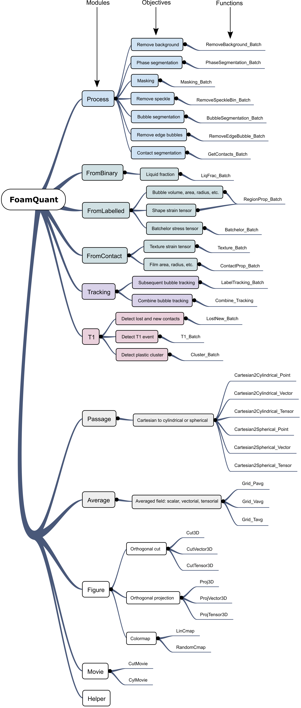
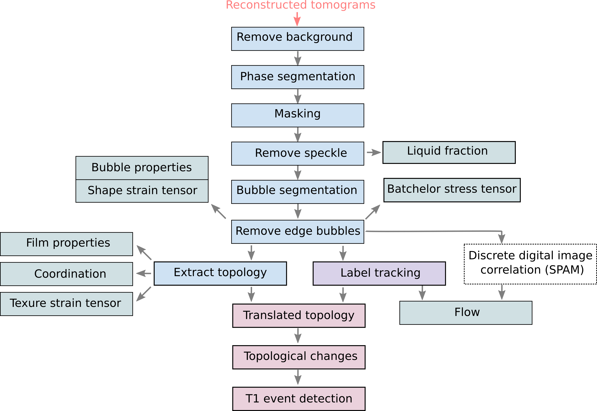
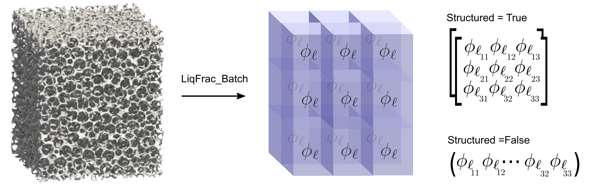
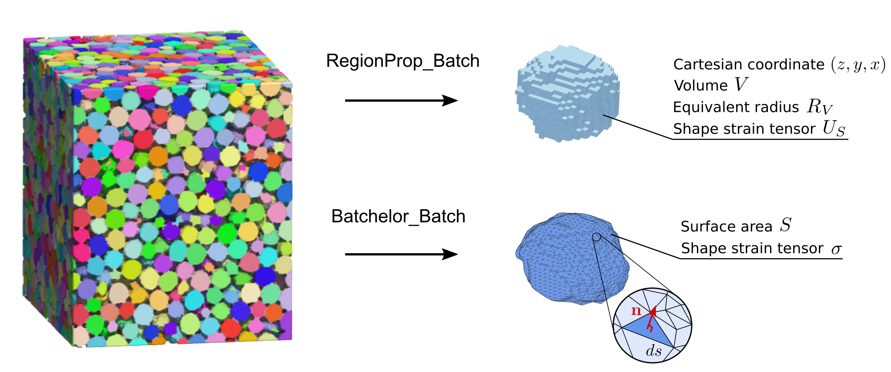
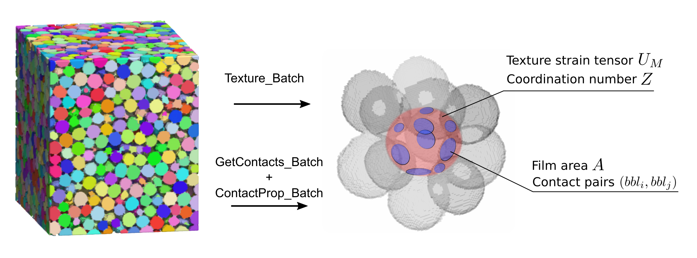
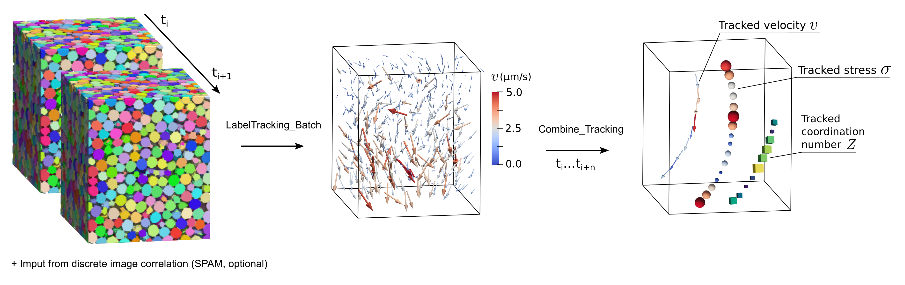
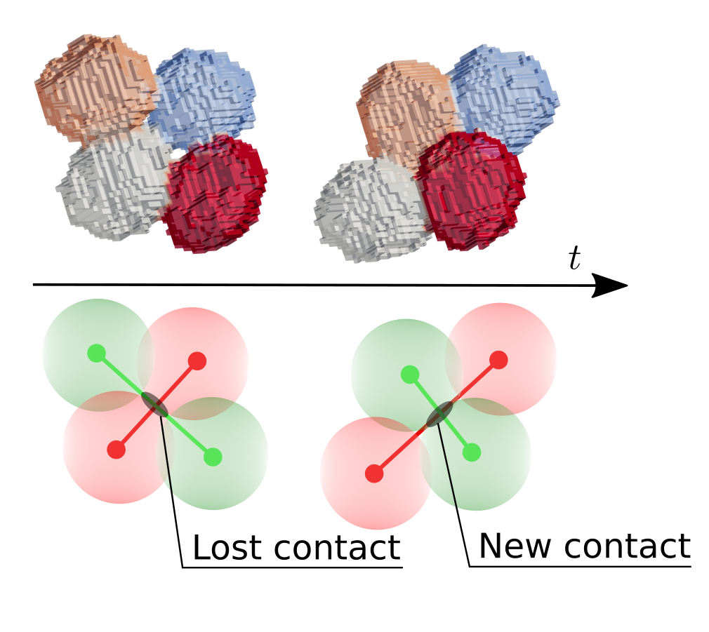
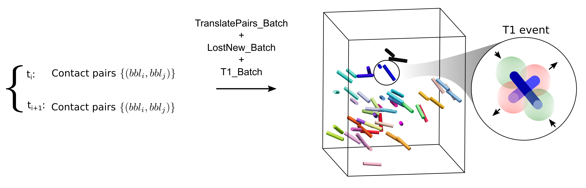
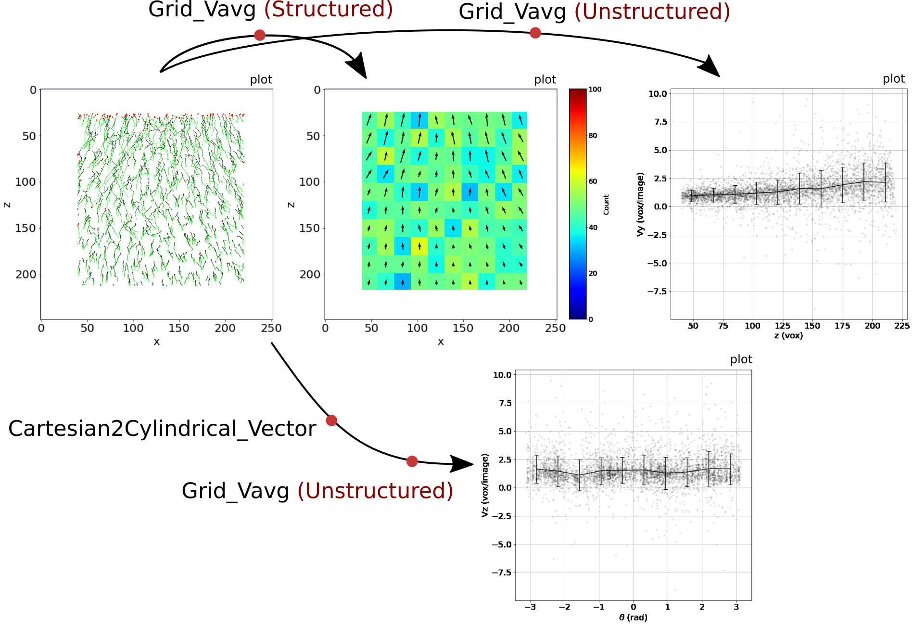
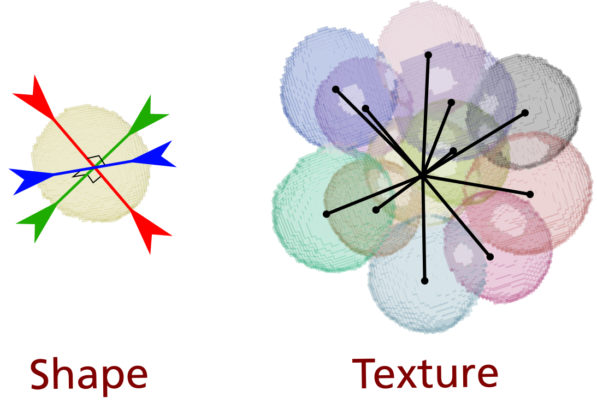

Modules overview
=======

**foamquant** is composed of 11 modules: 

Typical analysis pipeline
-----------------

Process
-----------------

The ``Process`` module focuses on the first image processing steps, aiming to produce phase-segmented and bubble-segmented images for the subsequent quantification. The provided functions are wrappers around existing tools from ``scikit-image`` [vanderWalt2014]_, ``SPAM`` [Stamati2020]_, and ``PoreSpy`` [Gostick2019]_, enabling the processing of the images in a sequence (batch-wise). 

As illustrated in the above figure, the image analysis pipeline first typically consist of the background removal, phase segmentation, masking, speckle removal, bubble segmentation, and edge bubble removal steps. Note that although used on foams, this generic processing is also applicable to analyze a wider range of porous materials, e.g., bread crumb during baking [Schott20232]_. An illustration of reconstructed, phase-segmented and bubble-segmented (pore-segmented) tomographic images is given in the following figure for a foam an a bread sample. 

.. figure:: processing.png
   :alt: Example of reconstructed, phase-segmented and bubble-segmented (pore-segmented) images.
   :width: 100%
   :align: center
   
Example of reconstructed, phase-segmented and bubble-segmented (pore-segmented) images from liquid foam (top) and bread (bottom) samples.

FromBinary
-----------------

Liquid foam microscopic structure at rest is described by mainly three structural parameters: the liquid fraction, the mean bubble size, and the dispersion in bubble sizes. The liquid fraction is quantified from the phase-segmented images, as the number of liquid phase voxels divided by the total number of voxels inside a given volume:

:math:`\phi_\ell = \frac{N_{l}}{N_{g} + N_{l}}`

where :math:`N_{l}` and :math:`N_{g}` are the liquid and gas volumes respectively in number of voxels.

   
The liquid fraction along a cartesian mesh can be returned **structured** or **unstructured** with the function `LiqFrac_Batch`.

FromLabelled
-----------------

Individual bubble properties such as their centroid Cartesian coordinates :math:`(z,y,x)`, volume :math:`V`, equivalent radius :math:`R_V=(3 V/(4\pi))^{1/3}` or shape strain tensor :math:`U_S` can be obtained from bubble-segmented images with the function `Region_Prop`. More advanced properties such as individual bubble surface area :math:`S` and Batchelor stress tensor :math:`(z,y,x)`.

   
FromContact
-----------------

Foam rigidity originates from its jammed structure. When sufficiently packed, the bubbles are trapped by their neighbors, allowing them to transmit forces through the foam structure. Jamming is related to the local structure *via* the mean number of neighbors or coordination number :math:`Z`. The contact topology between each bubble can be obtained from a bubble-segmented image using the `GetContacts_Batch` function. It provides quantities such as the individual bubble coordination number :math:`Z` and contact pairs between neighbooring bubbles :math:`(bbl_i,bbl_j)`. The function `ContactProp_Batch` then allow to extract individual film properties such as their ellipse-fitted area :math:`A` or normal orientation. Finally, the individual bubble strain texture tensor :math:`U_M`, taking into account the distance with the center of its neighboors, can be extracted with the function `Texture_Batch`.

Tracking
-----------------

The displacement of individual bubbles between successive images can be quantified using the SPAM toolbox's discrete digital image correlation (``ddic``) method, which uses two consecutive grayscale tomograms and one bubble-segmented image from the first time step. Due to the lack of intrinsic texture, contrast is enhanced by dilating the bubble regions to include the surrounding liquid channels [Schott2023]_. 

On the other hand, tracking allows the flow field to be measured as well as following individual bubble properties between subsequent bubble-segmented images. The `LabelTracking_Batch` function, inspired by ID-Track [Ando2013]_, tracks bubble centroids between two successive labeled images by incorporating a volume matching criterion to exclude segmentation artifacts [Schott2023]_. It can be optionally guided by the SPAM ``ddic`` results.  

T1
-----------------

Liquid foam is flowing through irreversible local rearrangements between the bubbles. The elementary rearrangement event is called T1 event [Weaire1984] and consist in a contact swap between four bubbles [Reinelt2000, Cantat2013]: a film between two bubbles vanishes, and a new film is formed between two neighboring bubbles as shown hereafter. 

In practice, lost and newly formed contacts are identified using the tracking and topological quantifications presented above. The pairs of bubble labels :math:`(bbl_i,bbl_j)` forming a contact are translated from one time step to the next. This allows for the detection of lost contact pairs :math:`L` and newly formed pairs :math:`N` between successive images. The sets :math:`L` and :math:`N` are then combined to identify elementary T1 events.

Passage and Average
-----------------

Functions to convert scalar, vectorial or tensorial properties from cartesian to cylindrical and spherical, and perform time/space averages.

   
In this example the displacement field is first expressed in a cylindrical basic and then averaged.

Two ways of measuring the internal strain field
-----------------

   - Shape field, defined in [Graner2008]_ and first used in [Raufaste2015]_

   - Texture field, defined in [Graner2008]_ 
   

Label traking
-----------------
The tracking method was inspired by ID-track presented in [Ando2013]_.

.. figure:: tracking_3d.PNG
   :scale: 70%
   
Tracking of five bubbles, showing various tracked properties: elastic internal strain, number of neighbours, velocity, and volume.

References
============
.. [vanderWalt2014] van der Walt, S., et al. (2014) scikit-image: image processing in Python. PeerJ 2, e453.

.. [Stamati2020] Stamati, H., et al. (2020). SPAM: Software for Practical Analysis of Materials, 5, 2286.

.. [Gostick2019] Gostick, J. et al. (2019). PoreSpy: A Python toolkit for quantitative analysis of porous media images. Journal of Open Source Software, 4(37), 1296.

.. [Ando2013] Andò,E. et al., Experimental micromechanics: grain-scale observation of sand deformation, Géotechnique Letters 2, 107–112, (2012) https://doi.org/10.1680/geolett.12.00027

.. [Hall2010] S. A. Hall et al., Discrete and continuum analysis of localised deformation in sand using X-ray μCT and volumetric digital image correlation. Géotechnique, 60(5), 315-322, (2010) https://doi.org/10.1680/geot.2010.60.5.315

.. [Graner2008] F. Graner et al., Discrete rearranging disordered patterns, part I: Robust statistical tools in two or three dimensions, Eur. Phys. J. E 25, 349–369 (2008) https://doi.org/10.1140/epje/i2007-10298-8

.. [Raufaste2015] Raufaste, C. et al., Three-dimensional foam flow resolved by fast X-ray tomographic microscopy, EPL, 111, 38004, (2015) https://doi.org/10.1209/0295-5075/111/38004

.. [Schott2023] F. Schott et al., Three-dimensional liquid foam flow through a hopper resolved by fast X-ray microtomography, Soft Matter, (2023) https://doi.org/10.1039/d2sm01299e

.. [Schott20232] F. Schott et al., Structural formation during bread baking in a combined microwave-convective oven determined by sub-second in-situ synchrotron X-ray microtomography, Food Research International, (2023) https://doi.org/10.1016/j.foodres.2023.113283
