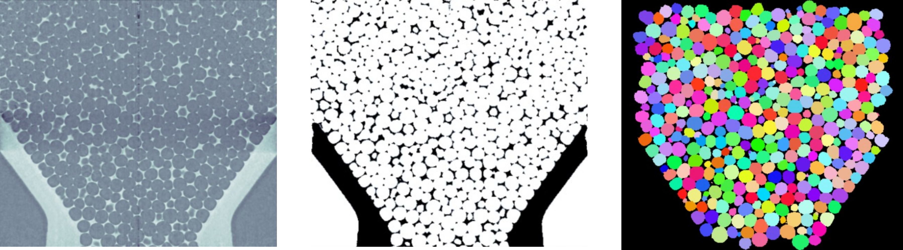
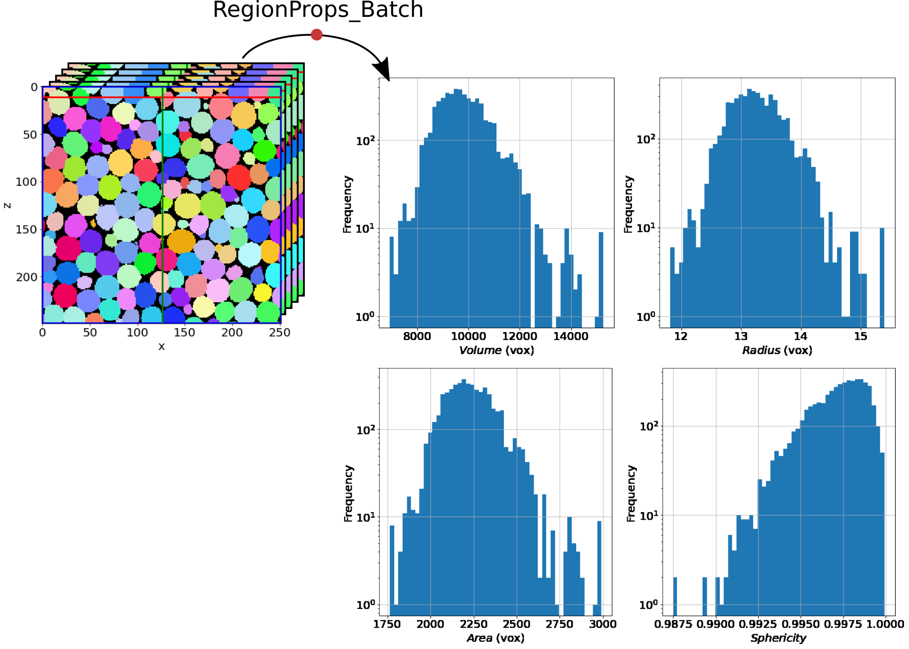
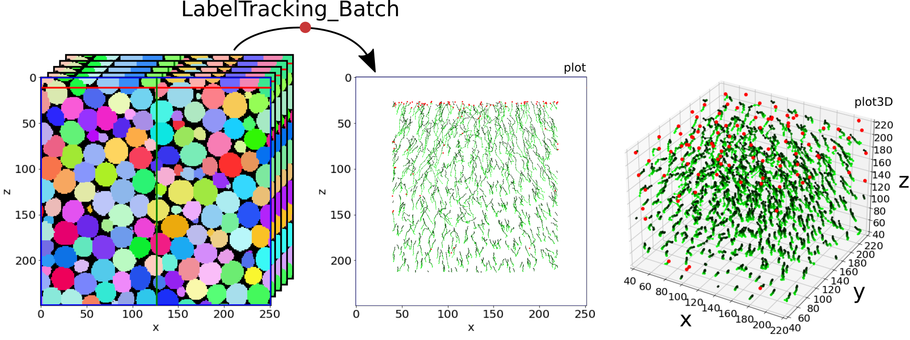

About
=======

**foamquant** is a toolbox specifically created for processing time series of 3D images of evolving liquid foams by using open source libraries Scikit-Image [vanderWalt2014]_ and SPAM [Stamani2020]_. 

The **objective** is a greater accessibility of time-resolved liquid foam 3D analysis tools for the foam-physicis and food scientists communitites.

The documentation consists of the following sections: **About**, **References**, **API** and **Examples**.

Toolbox overview
-----------------

.. figure:: Diagram.png
   :scale: 40%
   
Structure of the current package (python functions). The functions in red are not yet included in the package.

Process
-----------------

Functions for processing batch liquid foam images, all the steps from the raw-reconstructed images to the labelled images:

* Remove background (homogeneization)

* Phase segmentation (binarization)

* Masking (cylindrical or region of interest)

* Remove small objects and holes (volume threshold)

* Bubble segmentation (watershed)

* Remove edge bubbles (edge of a mask if provided)

   
From the left to the right: example of raw, phase segmented and bubble segmented images.

FromBinary
-----------------

Functions to quantify the liquid fraction from a batch of phase segmented images.

.. figure:: fromliqfrac.png
   :scale: 40%
   
The liquid fraction along a cartesian mesh can be returned structured or unstructured.

FromLabelled
-----------------

Functions to quantify the bubbles regions properties from a batch of labelled images.

Tracking
-----------------

Functions to track the bubbles and their properties from a batch of labelled images.

   
The color (from green to black) indicates the time index. The red points are the position of lost tracking.

Passage and Average
-----------------

Functions to convert scalar, vectorial or tensorial properties from cartesian to cylindrical and spherical, and perform time/space averages.

.. figure:: passage_average.png
   :scale: 40%

Two ways of measuring the internal strain field
-----------------

   - Shape field, defined in [Graner2008]_ and first used in [Raufaste2015]_

   - Texture field, defined in [Graner2008]_ 
   
.. figure:: shape_texture_3d.PNG
   :scale: 30%

Label traking
-----------------
The tracking method was inspired by ID-track presented in [Ando2013]_.

.. figure:: tracking_3d.PNG
   :scale: 50%

Tracking of five bubbles, showing various tracked properties: elastic internal strain, contact, velocity, and volume.

References
============
.. [vanderWalt2014] S. van der Walt et al., scikit-image: Image processing in Python. PeerJ 2:e453 (2014) https://doi.org/10.7717/peerj.453 

.. [Stamani2020] Stamati et al., (2020). spam: Software for Practical Analysis of Materials. Journal of Open Source Software, 5(51), 2286, https://doi.org/10.21105/joss.02286

.. [Ando2013] Andò,E. et al., Experimental micromechanics: grain-scale observation of sand deformation, Géotechnique Letters 2, 107–112, (2012) https://doi.org/10.1680/geolett.12.00027

.. [Hall2010] S. A. Hall et al., Discrete and continuum analysis of localised deformation in sand using X-ray μCT and volumetric digital image correlation. Géotechnique, 60(5), 315-322, (2010) https://doi.org/10.1680/geot.2010.60.5.315

.. [Graner2008] F. Graner et al., Discrete rearranging disordered patterns, part I: Robust statistical tools in two or three dimensions, Eur. Phys. J. E 25, 349–369 (2008) https://doi.org/10.1140/epje/i2007-10298-8

.. [Raufaste2015] Raufaste, C. et al., Three-dimensional foam flow resolved by fast X-ray tomographic microscopy, EPL, 111, 38004, (2015) https://doi.org/10.1209/0295-5075/111/38004

.. note::

   This project is under development. The Jupyter notebook are not uploaded yet, neither are all the tools.

