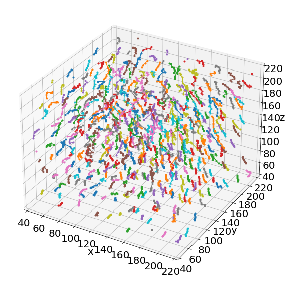
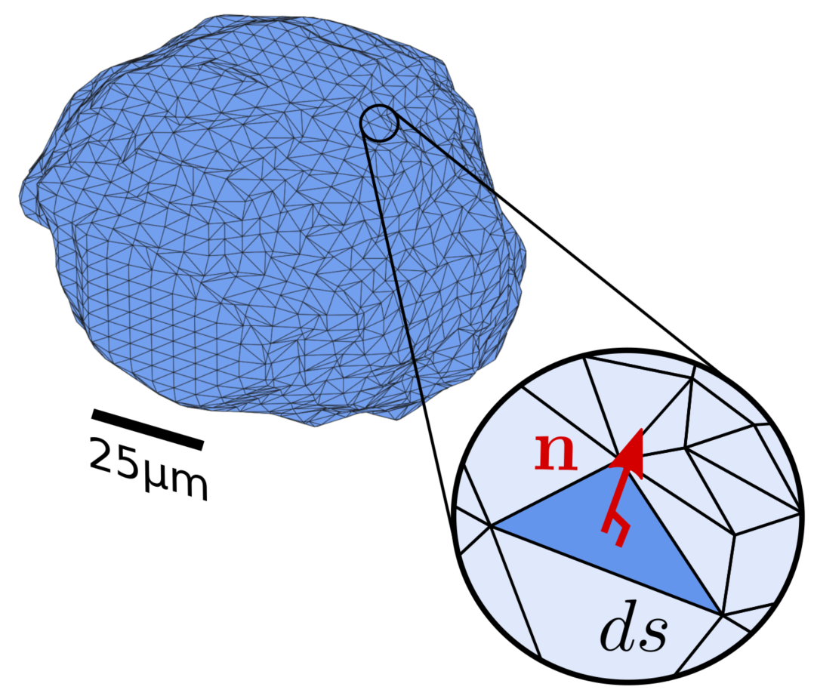

Examples
==================

List of examples:

* Image processing: from raw images to bubble-segmented images.

* Image quantification: Liquid fraction & Bubble radius.

* Image quantification: Strain & Stress fields.

* Image quantification: Plastic event detection.

Image processing: from raw images to bubble-segmented images
-----------------------------

Showing how to detect elementary contact rearrangment (T1) from bubble segmented images.

T1 events detected in a subvolume between two time steps

Jupyter notebook:

.. toctree::
   :maxdepth: 2
   
   Jupy_FoamQuant_Processing

Image quantification: Liquid fraction & Bubble radius
-----------------------------

Showing how to detect elementary contact rearrangment (T1) from bubble segmented images.

T1 events detected in a subvolume between two time steps

Jupyter notebook:

.. toctree::
   :maxdepth: 2
   
   Jupy_FoamQuant_lf_radius

Image quantification: Strain & Stress fields
-----------------------------

Showing how to detect elementary contact rearrangment (T1) from bubble segmented images.

T1 events detected in a subvolume between two time steps

Jupyter notebook:

.. toctree::
   :maxdepth: 2
   
   Jupy_FoamQuant_strain_stress

Image quantification: Plastic event detection
-----------------------------

Showing how to detect elementary contact rearrangment (T1) from bubble segmented images.

T1 events detected in a subvolume between two time steps

.. image:: Jupy_FoamQuant_T1_detection_files/Jupy_FoamQuant_T1_detection_29_0.png

Jupyter notebook:

.. toctree::
   :maxdepth: 2
   
   Jupy_FoamQuant_T1_detection

Old examples:

* Old: general presentation of a processing and quantification pipeline

* Old: Local stress measure

* Old: In-situ bread baking

Liquid foam flow and deformation
-----------------------------

Showing how to quantify the individual bubble properties, the flow field, and track the individual bubble. 

Binder version:

.. image:: https://mybinder.org/badge_logo.svg
 :target: https://mybinder.org/v2/gh/floschott/FoamQuant_binder/master?labpath=Jupy_FoamQuant.ipynb

Jupyter notebook version:

.. toctree::
   :maxdepth: 2
   
   Jupy_FoamQuant

Local stress measure
-----------------------------

Showing how to measure the individual bubble stress tensor from bubble segmented images.

Jupyter notebook:

.. toctree::
   :maxdepth: 2
   
   Jupy_FoamQuant_bachelor_stress

In-situ bread baking
---------------------

Showing how to apply FoamQuant tools on another cellular material: bread being 3D imaged while being backed!

Jupyter example:

.. toctree::
   :maxdepth: 2
   
   Jupy_Bread
