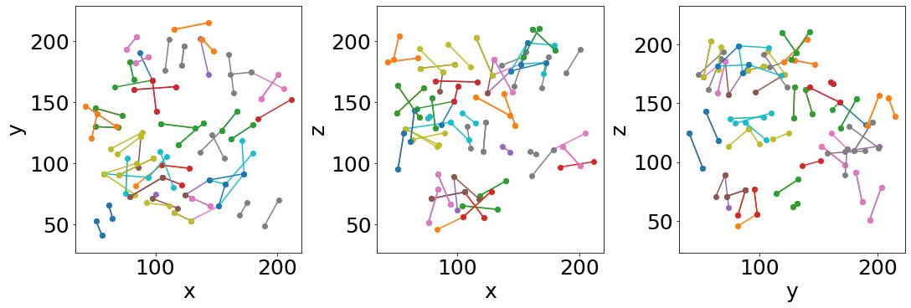

Examples
==================

Liquid foam flow and deformetion
-----------------------------

Binder tutorial:

.. image:: https://mybinder.org/badge_logo.svg
 :target: https://mybinder.org/v2/gh/floschott/FoamQuant_binder/master?labpath=Jupy_FoamQuant.ipynb

Jupyter example:

.. toctree::
   :maxdepth: 2
   
   Jupy_FoamQuant

Local stress measure
-----------------------------

Jupyter example:

.. toctree::
   :maxdepth: 2
   
   Jupy_FoamQuant_bachelor_stress

Local elementary topological rearrangement detection
-----------------------------

T1 events detected in a subvolume between two time steps

Jupyter example:

.. toctree::
   :maxdepth: 2
   
   Jupy_FoamQuant_T1_detection
   

In-situ bread baking
---------------------

Jupyter example:

.. toctree::
   :maxdepth: 2
   
   Jupy_Bread
